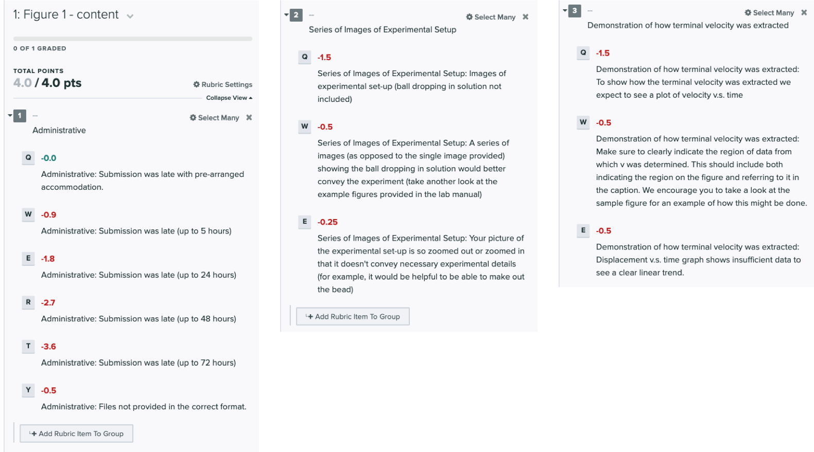
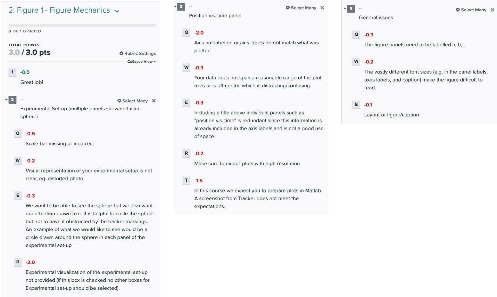
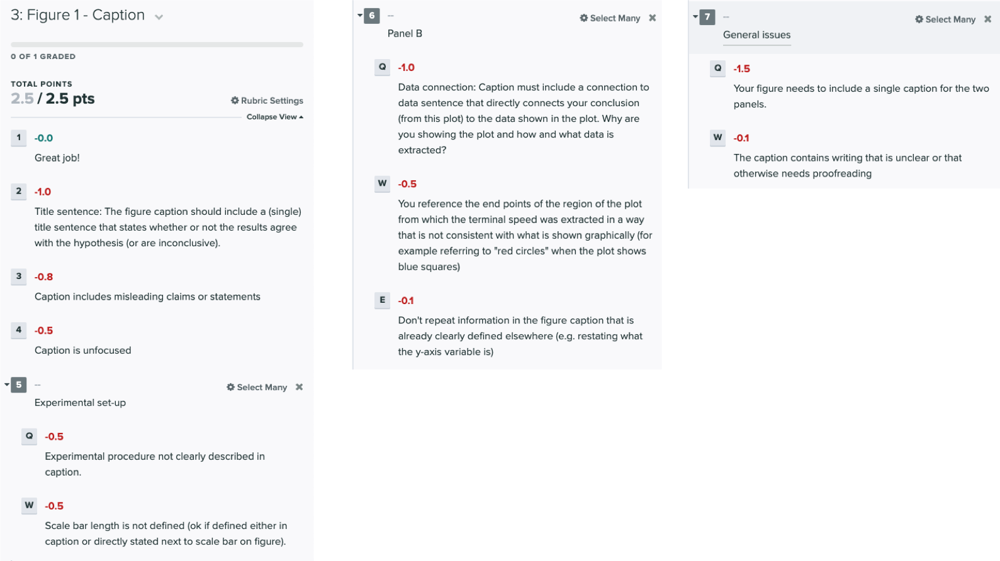
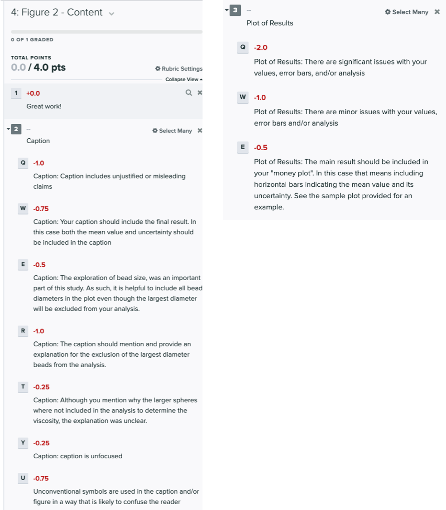
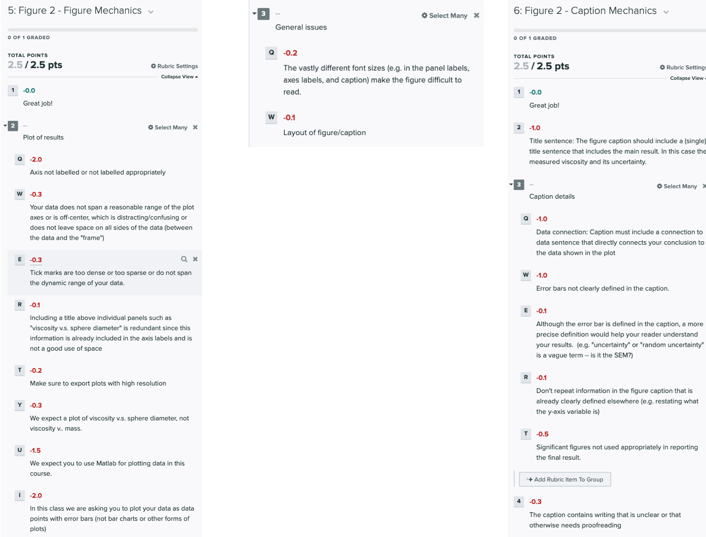

This was at the end of week 4 but has been put aside for now.
## Grading rubric

The tentative rubric that will be used to evaluate this checkpoint is provided below. Please keep in mind that these rubric items are subject to change as we can never foresee all the issues that may arise. This is meant to give you a sense of how it will be graded.

Your deliverable will be graded out of 18 points. 

**Click on the below images to enlarge in a new tab:**

{:target="_blank"}

{:target="_blank"}

{:target="_blank"}

{:target="_blank"}

{:target="_blank"}