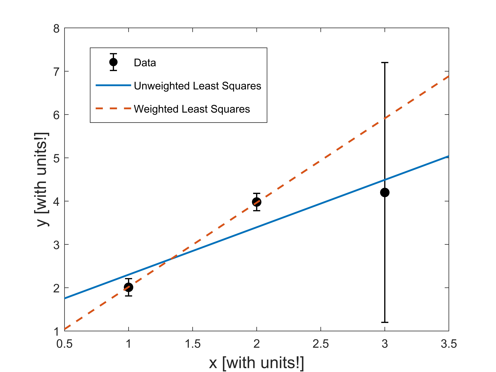
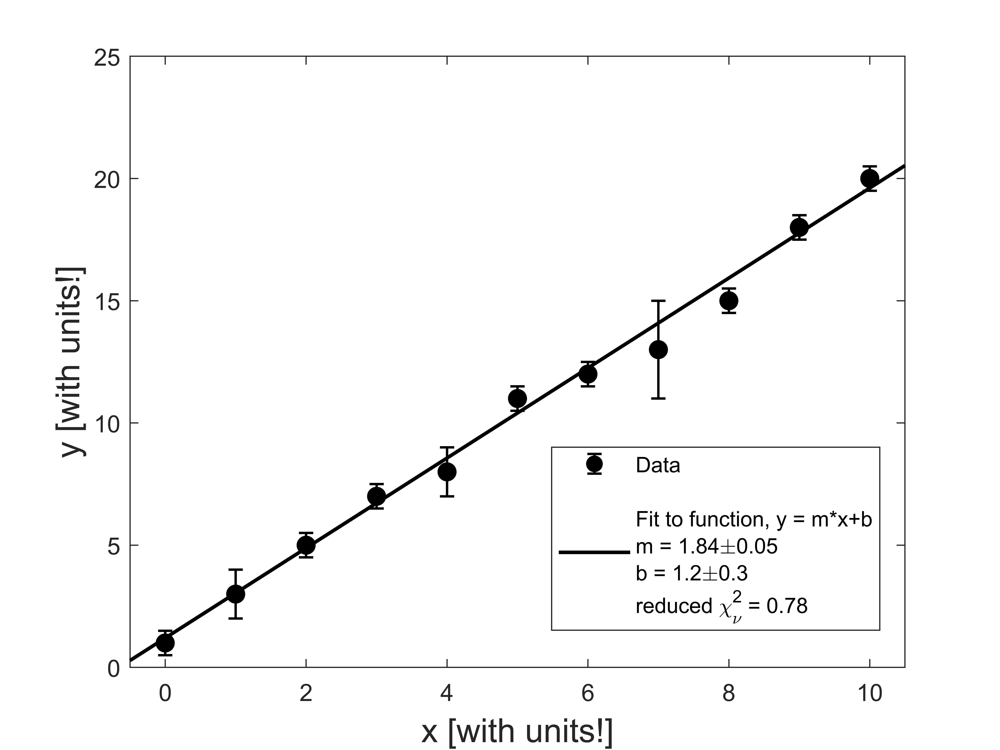
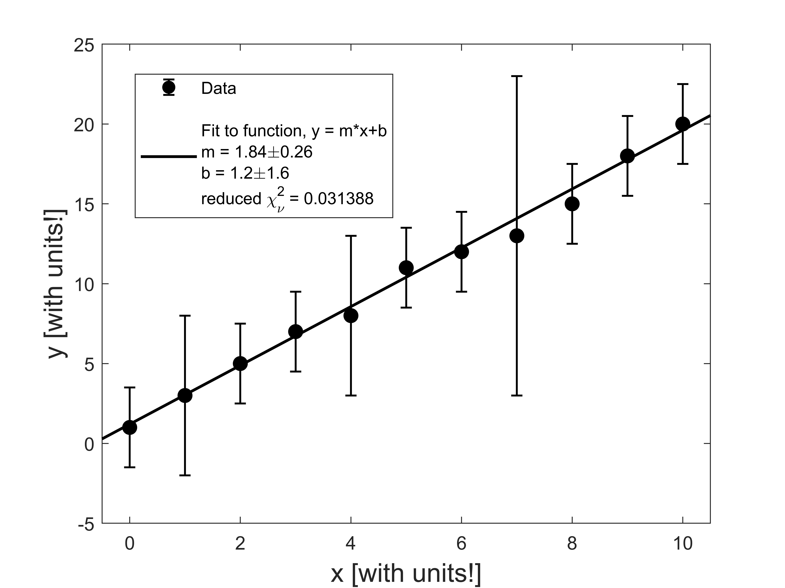
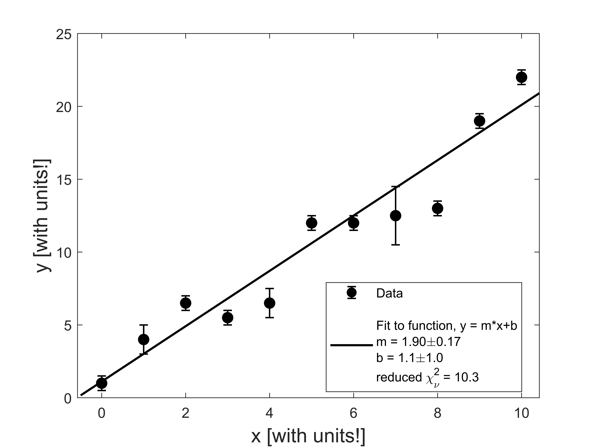

# Curve Fitting 

The process of fitting a theoretical function to data is an important skill for all experimental scientists to master. In Module 3, we will be fitting our data of $$x$$ vs. $$L$$ to a straight line, and then use the fitted slope to measure the wavelength of light coming from our laser pointer. Here we will give you example MATLAB code that you can use to determine the best-fit line of your data. This code is also versatile enough for you to recycle for your future curve-fitting needs. 

This page is divided into two parts. The first part, "Linear Fitting Introduction", is the bare minimum information that you will need to understand and use the curve fitting code for Ph50 Module 3. We realize that many of you are busy and overwhelmed right now with workload, so we don't expect you to go beyond this introduction.

But if you have a few extra minutes, check out the second part, "A Closer Look at Curve Fitting". This information should help you understand more clearly what the code is doing, and might be something you will return to in your upper division courses (e.g. for you future physicists or data scientists).

## Linear Fitting Introduction

**Why can't I just use the "trendline" feature in Excel or Google Sheets?**

Spreadsheet software has a bulit-in features to fit data, and it would be wonderful if we could use those. But the built-in fitting for Excel (or Google Sheets) falls short in a couple of important ways:

#### 1. Excel treats all points equally (i.e. an "unweighted" fit)

Suppose we are fitting a set of $$n$$ data points $$\{x_i\}_{i=1}^{n}$$ and $$\{y_i\}_{i=1}^{n}$$ to a straight line $$y(x) = mx + b$$. The "trendline" function will perform an unweighted least squares fit by finding the values of $$m$$ and $$b$$ that minimize the distance between the data and fit line. In mathematical language (if that's something your into),  we are finding $$m$$ and $$b$$ that satisfy

\begin{equation}
\underset{m,b}{\mathrm{argmin}} \sum_{i=1}^{n} (y_i - (mx_i+b))^2.
\end{equation}

One shortcoming of this unweighted least squares fit is that it treats all data points equally, even ones with really big error bars. We often measure data points that have different error bars and these error bars represent how confident we are about our measured values. 

\begin{equation}
\chi^2 = \underset{m,b}{\mathrm{min}} \sum_{i=1}^{n} \frac{(y_i - (mx_i+b))^2}{(\delta y_i)^2}.
\end{equation}

The Greek letter "chi" pronounced like ["Kai"](https://www.marketplace.org/2020/10/01/canadas-tourist-driven-pne-pivots-to-hosting-film-production/){:target="_blank"}.

#### 2. Excel doesn't give us an uncertainty in the slope and intercept

#### 3. Excel doesn't give us a relevant measurement of how good the fit is

## A Closer Look at Curve Fitting