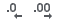
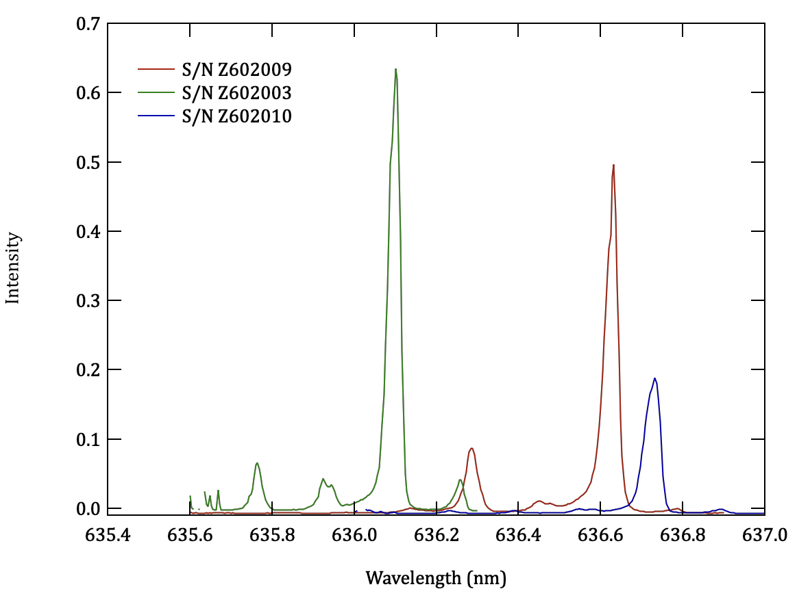

The physics 50 lab manual is offline for the remainder of the semester. However, here is some feedback on the module 3 deliverable:

# Module 3 Deliverable

Module 3 explores the phenomenon of diffraction, using the light from a diode laser pointer and two sets of gratings. The angle at which light scattered by an evenly spaced set of "slits", with spacing $$d$$, is used to measure the wavelength of the laser. This method is often used, albeit with higher-quality gratings and narrow slits to define the angle of diffraction very precisely, to determine the wavelengths present in a light source.

In the first week you learned that the normal to the grating must be aligned with the incident beam; otherwise, the spacing of the first-order diffraction spots from the undeviated beam are unequal. You likely also observed that the five different gratings you had to use did not behave identically. If you know the wavelength with confidence, you can use it to figure out the true grating period $$d_n$$ of each grating. If you don't know the laser wavelength, you can attempt to remove the bias introduced by the different values of $$d_n$$ by combining the results from all the gratings. A potential drawback to this approach arises when the differences in the $$d_n$$ values exceed your measurement resolution, since the variations you observe will then not be random but systematic, leading to large values of SEM and small values of $$\chi_\nu^2$$.

## Raw data

An important point of this module was to highlight the advantage of using a linear fit to combine a complete set of measurements to yield the best possible estimate of diffraction angle. This strategy means automatically corrects for any systematic error in length measurement, such as forgetting that the grating is not located directly above the front edge of its holder. Forming the ratio $$x/L$$ for individual choices of $$L$$ (or $$x$$) would bake in that systematic error. For full credit, therefore, your analysis should have proceeded as follows:

1. In Week 2 you measured $$x$$ as a function of $$L$$ for at least 5 different values of $$L$$ ($$x$$), forming the mean and standard error of the mean for each value of the independent variable. In many cases, your ability to measure the position of the diffracted spot was limited by the resolution of the measuring equipment (and/or the size of the spot), and so **it was appropriate to combine in quadrature the SEM with the resolution uncertainty.**

2. You should have carried out the same procedure in Week 3 with the 1000 lines/mm gratings, producing an analogous linear plot of $$x$$ vs. $$L$$ (or vice versa). Each of these plots should show data points that explore **the full range of diffraction distances available to you.**

## Analysis

1. A plot and weighted least-squares linear fit of $$x$$ vs $$L$$ yields a slope $$m$$ that corresponds either to $$\tan\theta$$ (if you used $$L$$ as the independent variable) or $$\cot\theta$$ (if you used $$x$$ as the independent variable). It is **very important** not to round off the mean and uncertainty values that you deliver to the fit. **In general, one should carry full precision for *all* intermediate computations and only round values for display purposes.** In a spreadsheet, just use the display digits buttons,  to alter the way the values are displayed in the spreadsheet. This only affects how the values are displayed and does not round them internally. You should also comment on the self-consistency of the fit. Is the value of $$\chi_\nu^2$$ reasonable? If it is very large, did you forget to include resolution uncertainty? If it is too small, yet you were very careful every step of the way, perhaps your gratings were sufficiently different from one another to cause the excessive variance in the data points.

2. Analyzing the right triangle for which $$x$$ and $$L$$ are the sides yields the relation
\begin{equation}
  \sin\theta = \frac{x}{\sqrt{x^2+L^2}} = \frac{m}{\sqrt{1+m^2}} = \frac{1}{\sqrt{1+\mu^2}}
\end{equation}
where $$\mu = L/x$$ is the slope of the fitted line when $$x$$ is the independent variable. Using the usual formula for error propagation, you can obtain the uncertainty in $$\sin\theta$$ in terms of either $$\delta m$$ or $$\delta \mu$$ via
\begin{equation}
  \delta(\sin\theta) = (1+m^2)^{-3/2} \; \delta m = \frac{\mu}{(1 + \mu^2)^{3/2}} \; \delta\mu
\end{equation}
which can then use in formula for the first-order diffraction peaks:
\begin{align}
  \lambda &= d \sin\theta \\\\ \delta\lambda &= d \frac{\delta m}{(1+m^2)^{3/2}} = d \frac{\delta \mu}{(1+\mu^2)^{3/2}}
\end{align}

   + **This approach is superior to attempting to "correct" the value of $$L$$** by using $$\sqrt{L^2+x^2}$$ as the independent variable, since that computation combines the "precise" value $$L$$ with the uncertain value $$x$$ to yield a new "precise" value for the independent variable (which should now carry uncertainty).

   + Several people forgot the order of operations in algebra and programming languages. Exponentiation takes place before multiplication and division, which are then followed by addition and subtraction. Therefore, if you write something like `(1+m^2)^3/2`, you get half of the cube of the quantity in parentheses, not that quantity raised to the 3/2 power. This one was tricky to track down!

3. After computing slopes for both the 500 lines/mm and 1000 lines/mm gratings, you should combine these results **with a weighted average**, which you can compute by fitting to a constant. If you just average the two values, you are disregarding that one tends to be more precise than the other. The result of that weighted average will be $$\lambda \pm \delta \lambda$$ and your plot should show a horizontal line for $$\lambda$$ and dashed horizontal lines for $$\lambda + \delta\lambda$$ and $$\lambda - \delta\lambda$$.

4. A person who has done a very careful job and who has closely matched gratings should find that the two measurements for $$\lambda$$ are consistent, taking account of their uncertainties. If they aren't, *variation between the nominal grating frequency and the nominal value you used is likely the cause.*

# Bonus Information

The lasers are not identical. The actual wavelength depends on steps in the manufacturing process that are not under precision control. I took the liberty of measuring the spectra of three of the lasers, as shown in Fig. 1. There is even less uniformity in the grating period of the inexpensive diffraction gratings you used. An important moral of this story: **do not pretend that *nominal* values have infinite precision!** 

  

**Figure 1** --- The lasers used in Physics 50 emit at different wavelengths. The figure shows emission spectra of three of the lasers used in Physics 50 (identified by their serial numbers), as measured by the SPEX 500 grating spectrometer in the optics laboratory. The wavelengths that emerge from the laser arise from a negotiation between the band gap of the lasing material and the standing wave modes inside that material; for maximum gain and intensity, an integral number of half-wavelengths should fit between the polished, mirror-like faces of the lasing medium. The standing wave closest to the actual band gap is the one that produces the largest peak, but weaker modes appear, typically at shorter wavelength (higher photon energy).

