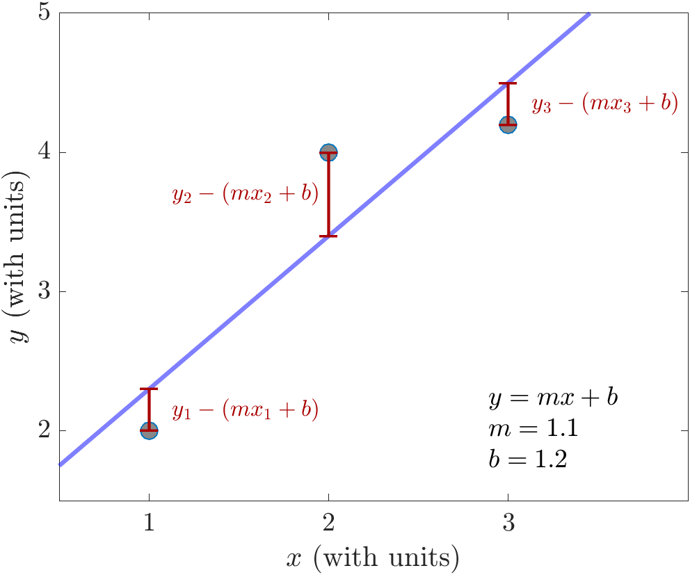
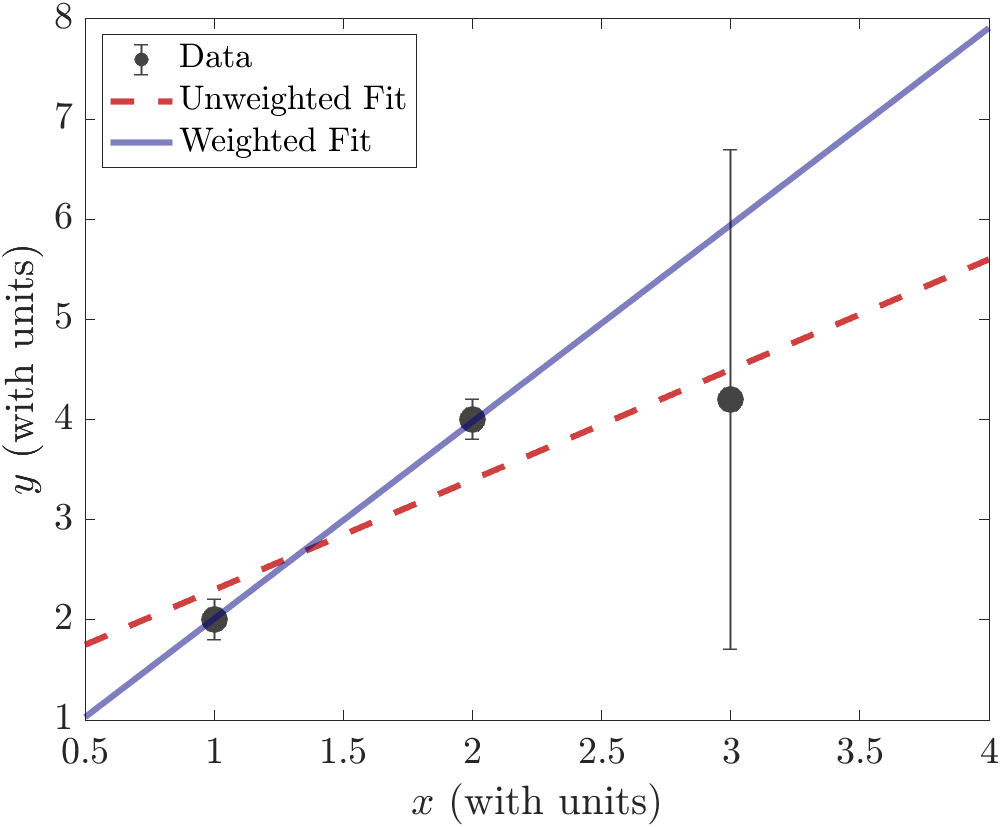
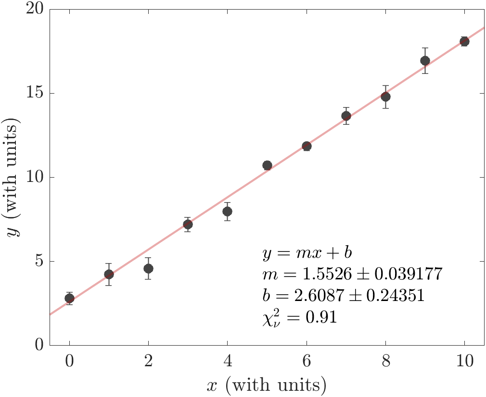
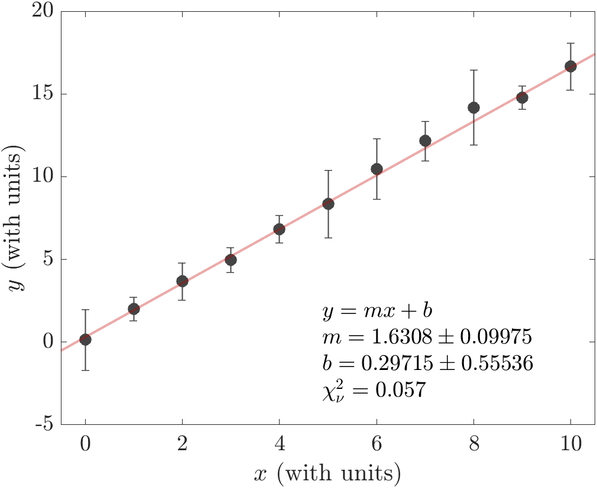
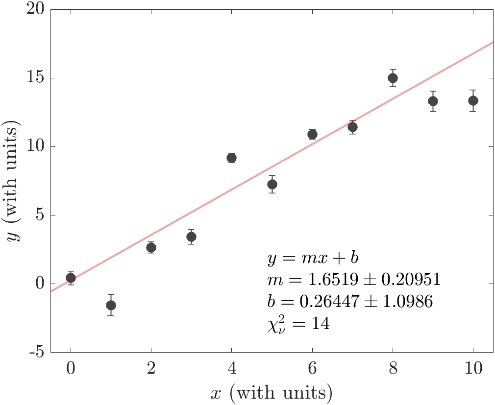

# Curve Fitting

<!-- PNS: I have been removing some of the "our" "our" "our" treatment and have changed some of the use of "error bars" to connect with the underlying **uncertainties** that they represent. -->

The process of fitting a theoretical function to data is an important skill for all experimental scientists to master, and in Physics 50 we are laying a foundation for this skill. In Module 3, we will be fitting our data of $$x$$ vs. $$L$$ to a straight line, and then use the fitted slope to measure the wavelength of light coming from our laser pointer. Here we will give you example MATLAB code that you can use to determine the best-fit line of your data. This code is also versatile enough for you to recycle for your future curve-fitting needs. 

This "Linear Fitting Introduction" is meant to provide the bare minimum information that you will need to understand and use the curve fitting code for Ph50 Module 2. <!-- We realize that many of you are busy right now with a high workload, so we don't expect you to go beyond this introduction. -->
But if you would like more information, please go through the commented code and come to office hours to discuss. We are happy to help you understand more clearly what the code is doing! And curve fitting might be something you will return to in your upper division courses.


## Linear Fitting Introduction

**Why can't I just use the "trendline" feature in Excel or Google Sheets?**

Spreadsheet software has a built-in features to fit data, and it would be wonderful if we could use those. But the built-in fitting for Excel (or Google Sheets) falls short in a few important ways:

1. Excel treats all data points equally (i.e. an "unweighted" fit)
2. Excel doesn't give us an uncertainty in the slope and intercept
3. Excel doesn't give us a relevant measurement of how good the fit is


#### 1. Unweighted vs. Weighted Fit

Suppose we are fitting a set of $$n$$ data points $$\{(x_1,y_1), (x_2,y_2), \ldots, (x_n,y_n)\}$$ to a straight line $$y(x) = mx + b$$. The "trendline" function in Excel will perform an unweighted least squares fit by finding the values of $$m$$ and $$b$$ that minimize the distance between the data and fit line. In mathematical language (if that's something you're into),  we are finding $$m$$ and $$b$$ that satisfy
\begin{equation}\label{eq:unweighted}
\underset{m,b}{\mathrm{argmin}} \sum_{i=1}^{n} (y_i - (mx_i+b))^2
\end{equation}
If you look at that sum, each term is the squared difference in height, on a $$y$$ vs. $$x$$ plot, between the actual measured value $$y_i$$, and the predicted value $$mx_i +b$$ from the linear fit. So by adjusting the values of the parameters $$m$$ and $$b$$, this type of fitting minimizes the difference between the measured values and the predicted values.

For example, if we have three data points $$(x_1,y_1)$$, $$(x_2,y_2)$$, $$(x_3,y_3)$$, an unweighted fit to those data points would minimize the total squared distance between the data and the fitted line.
 


In the plot above, the fitting procedure adjusts the values of $$m$$ and $$b$$ to minimize the sum of the squared lengths of the red lines.

One shortcoming of the unweighted least squares fit of Eq. \eqref{eq:unweighted} is that it treats all data points equally, even ones with really big error bars. We often measure data points that have different uncertainties. Because the uncertainties represent how confident we are about our measured values, we should take into account our relative confidence about each data point.

For example, let's look at those same three data points, but where each $$y_i$$ has a corresponding uncertainty $$\delta y_i$$. In this example, let's make the uncertainty in the third data point much larger than the other two:


An unweighted fit (red, dashed line) treats all three of those data points equally. Although this fit line is "close" to all three data points, it doesn't account for the fact that some data points are more reliable than others. That's because the unweighted fit doesn't take into account the extra information we have about the uncertainty in the data. 

**When the error bars aren't all the same, we want to use a weighted least-squares fit.** In a weighted least-squares fit, the minimization is performed in a slightly different way than Eq. \eqref{eq:unweighted}. The difference between data and the fit line is divided by the error bar (uncertainty) for each point. In the fit we determine the values of $$m$$ and $$b$$ that minimize the quantity 
\begin{equation}\label{eq:weighted}
\chi^2 = \underset{m,b}{\mathrm{min}} \sum_{i=1}^{n} \left(\frac{y_i - (mx_i+b)}{\delta y_i}\right)^2
\end{equation}
Here, $$\chi$$ is the Greek letter "chi" (pronounced like ["Kai"](https://www.marketplace.org/2020/10/01/canadas-tourist-driven-pne-pivots-to-hosting-film-production/){:target="_blank"}).

Performing a weighted least-squares fit on the example data above, we get the solid blue line. When we do a weighted least-squares fit, we expect to find that **each data point is about one error bar away, on average, from the fitted line.**

#### 2. Uncertainties in the fitted slope and intercept

For Module 2, we are giving you a weighted curve-fitting script for MATLAB that provides an estimate of the uncertainty in the fitted slope and intercept. The uncertainty in the slope and intercept are determined from the error bars and from how scattered the data are about the fit line. Here's an example of the output of the script on some sample data:


The legend has some important information about the fit. The best-fit slope and intercept are provided, along with their uncertainties. 


#### 3. Using reduced chi-squared, $$\chi_\nu^2$$, to determine how good your fit is

Also reported in the legend is the "reduced chi-squared", $$\chi_\nu^2$$, which is a normalized version of $$\chi^2$$ from Eq. \eqref{eq:weighted}. The reduced chi-squared is defined by 
\begin{equation}
\chi_\nu^2 = \frac{\chi^2}{\text{num data points -- num fitting parameters}}
\end{equation}

In the example data above, we had 11 data points and two fitting parameters ($$m$$ and $$b$$). Roughly speaking, the reduced $$\chi^2$$ value tells us on average how many error bars away each data point is from the fitted line. So the value $$\chi_\nu^2 = 0.91$$ in the example means that *on average* each data point is just within its error bar of the fitted line. Looking at the data and fit above, although there are a couple of data points that are farther away from the line than their error bars, on average they fall within their error bar of the fitted line.

**The value of $$\chi_\nu^2$$ is important because it can tell us how good our fit is (or sometimes, how well we estimated the error bars).** If the error bars are an accurate representation of the uncertainty in the data, we would expect *on average* each data point to be approximately one error bar away from the line: $$\chi_\nu^2 \approx 1$$. In the example above, the value of $$\chi_\nu^2 = 0.91$$ supports the idea that our linear fit is a good model of the data.

Let's look at two examples where our reduced $$\chi^2$$ value differs significantly from 1. First, here's an example where $$\chi_\nu^2$$ is small:


In this example, each data point is much closer than 1 error bar to the fitted line. There are a few ways that a $$\chi_\nu^2 \ll 1$$ can occur: 

+ perhaps we have too many free parameters in the fitting function, allowing the function to hit all the data points. However, we only have 2 parameters here ($$m$$ and $$b$$), so that's not the issue;
+ perhaps it was just a random coincidence that the values lined up, but we have many data points lining up, so that's probably not it either; 
+ we overestimated the error bars.

The third option seems most likely in this case. So **if our data looked like this, we should double-check the calculation of uncertainties.**

Finally, let's take a look at an example where the data points are typically much further than 1 error bar away from the fitted line:



This large value of $$\chi_\nu^2$$ tells us that:

+ perhaps our model (fitting function) isn't right;
+ perhaps there's a coincidence occurring, but we have many data points not falling on the line so that's probably not the issue;
+ perhaps we underestimated the uncertainties.

The first and third options are both plausible, so we would have to think carefully about how to proceed. If we are sure about our data and reasonably confident in our uncertainty estimate, maybe we need to re-think the theoretical model we are using!

### MATLAB Code

To use the MATLAB code first make sure you have the "curve fitting toolbox" and the "statistics and machine learning toolbox" installed. In the MATLAB environment, go to "HOME"-->"Add-Ons"-->"Get Add-Ons":


and search for the "curve fitting toolbox":


If it says "Installed" you are good to go. Otherwise, click on the Curve Fitting Toolbox page and install it. Now do the same for the "Statistics and Machine Learning Toolbox".

Now download this file for [weighted curve fitting of data with uncertainties](curve_fitting.m) and run the script. 

Every time you run the scripts, you will get the following warning in the command window:


This warning appears because we aren't providing the fit function with an initial guess of the slope and intercept. The function is picking an initial guess randomly. The initial guess might affect the fitting if you have many fitting parameters, but because we only have 2 fitting parameters $$(m,b)$$, **you can safely ignore this warning.**

To use the script for your own data, replace the "import data" section of the code (lines 8--10) with your own data pasted in. You should also customize the plot appearance (lines 15--25) and change the axis labels (lines 38--40). Everything else should not need modification in the script if you are fitting a straight line to your data.

#### Optional 

In the future (i.e., not needed in Ph50), if you'd like to fit a different function to your data, you can change line 52 of the code to a different function. You could, for example, fit to a quadratic by replacing line 52 with:

``` MATLAB
fit_func = @(a,b,c,x) a*x.^2 + b*x + c;  
```
