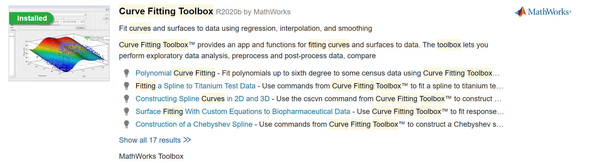
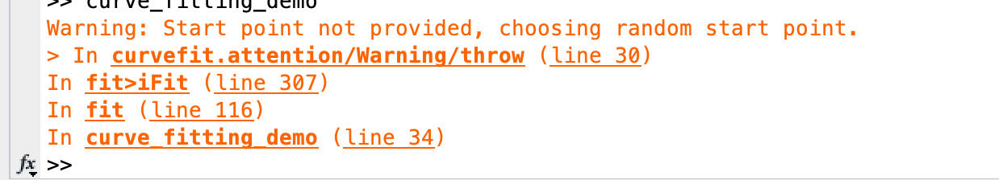
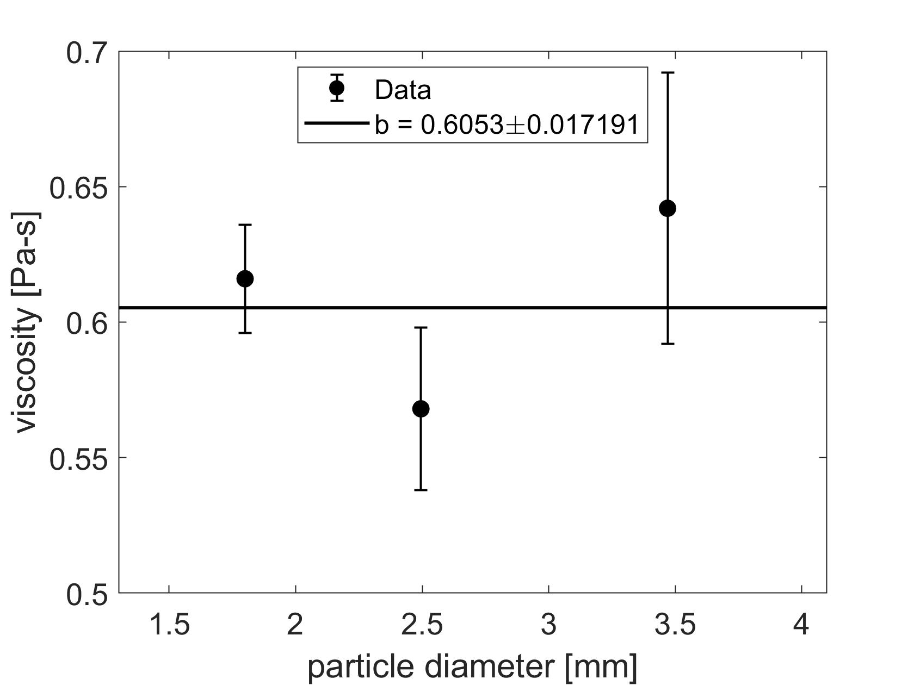

# Week 3:  Final Determination of Viscosity

--------------

1. [Thinking Through Systematic Errors](#thinking-through-systematic-errors)
2. [Mathematical Tools for Final Value and Uncertainty](#mathematical-tools-for-final-value-and-uncertainty)
3. [Finding the Viscosity Value and Random Error by Fitting a Horizontal Line](#finding-the-viscosity-value-and-random-error-by-fitting-a-horizontal-line)
4. [Week 3 To-Do Summary](#week-3-to-do-summary)
5. [Checkpoint: Final Viscosity and Uncertainty](#checkpoint-3)

------------------

**Make sure you have your [Module 2 Data Sheet and Lab Notebook](https://classroom.google.com/c/MTI2NjQ0NDEyMTAx/a/MTYyMDg1ODM5NjY3/details){:target="_blank"} handy as you go through the content on this Week 3 page.**

## Thinking Through Systematic Errors

In Week 2 we discussed the idea of systematic error and you may have brainstormed various possible sources of systematic error in this experiment, beyond the presence of inertial drag.  However, your investigations in Week 2 were focused on understanding the effect of inertial drag and identifying data for which that effect is minimal.  That investigation set you up with a plan for finding a final viscosity value and uncertainty, based on judicious use of the data available to you.  Before you embark on that final process, let's take some time to consider some other possible sources of systematic error.

#### 1 Systematic Error from Ruler Calibration?  Randomized!

One factor you might have put on your list is error in the pixels-to-distance calibration.  Our calibration of distance affects the terminal speed we extract from each video and thus the viscosity we calculate.  The short video [GOPR0702.mp4](https://drive.google.com/file/d/11u-_Ott90CjFBwaUwRasEXF7gqRn2tDB/view?usp=sharing){:target="_blank"} shows what could happen if the calibration ruler is placed too far forward or too far backward relative to the location where the sphere actually falls; you can see that if the ruler is forward/backward of the actual sphere drop, the pixels-to-distance calibration based on the ruler will be slightly off.  Using the video and stepping through your method for finding terminal speed and then viscosity, answer the following question:

#### Miniquestion 1: How Ruler Placement Affects Results
*[Click here to open in a new tab](https://docs.google.com/forms/d/e/1FAIpQLSfgLlDCQo_g__WABqmSmHxOC2VvgXbUYT6GBc_g0vER5hY93A/viewform){:target="_blank"}*

<iframe src="https://docs.google.com/forms/d/e/1FAIpQLSfgLlDCQo_g__WABqmSmHxOC2VvgXbUYT6GBc_g0vER5hY93A/viewform?embedded=true" width="640" height="300" frameborder="0" marginheight="0" marginwidth="0">Loading…
</iframe>

------------------

So how does this actually affect our results, since we placed the ruler separately in each video, as close as we could to the correct spot?  We can presume that when we tried to hit the correct spot each time, we were sometimes slightly in front and sometimes slightly behind.  Because we did this calibration from scratch for every single trial, **the shifts caused by an incorrect ruler calibration are already built into the trial-to-trial variation we see in our measured terminal speeds!**  This is an example of experimental design to randomize what could otherwise have been an unknown systematic error in our experiment.

#### 2 Systematic Error from Sphere Diameter and Mass?  Probably Randomized!

Terminal speed is not the only measured quantity that goes into our calculation of viscosity.  The mass and diameter of the sphere are also important, so we shoud examine our knowledge of these a bit more closely.  Our mass measurements had some trial-to-trial variation, while our diameter measurements were primarily limited by resolution error.  For example, for the nominal 3.5-mm spheres, our measurements of ten sphere masses ranged from 0.1768 g to 0.1777 g, but our measurements of ten sphere diameters all came out to 3.47 mm.

| Nominal Sphere Diameter | Average Mass | Standard Error of Mass | Measured Diameter |
| ----------------------- | ------------ | ---------------------- | ----------------- |
| 1.8 mm                  | 0.02453 g    | 0.00007 g              | 1.80 mm           |
| 2.5 mm                  | 0.06554 g    | 0.00007 g              | 2.495 mm          |
| 3.5 mm                  | 0.1772 g     | 0.0001 g               | 3.47 mm           |
| 4.5 mm                  | 0.3812 g     | 0.0002 g               | 4.50 mm           |
| 6.0 mm                  | 0.8997 g     | 0.0002 g               | 5.99 mm           |

The variation in measured masses suggests there may also be some variation in diameters that our digital calipers simply lack the digits to resolve.  What if the diameters of the 3.5-mm spheres actually ranged between about 3.467 mm and 3.473 mm?  This would roughly explain the variations in measured masses.  

How much should we worry about this?  If we had used a single sphere for all the videos, then we would have a systematic error in our viscosity results if that sphere were actually slightly larger or smaller than the values we used in our calculation.  But we used a different sphere in each video -- so the variation in terminal speeds should automatically be averaging over the range of sphere diameters and masses already!

One caveat remains:  because we used different spheres for each trial, the effect of sphere-to-sphere size variation is automatically included in the variation in terminal speed values.  However, this does not quite insure us against the possibility that the sphere diameters are distributed around some true average value that is not exactly 3.470 mm (or 1.800 mm or 2.495 mm ...).  Thus we could have a small systematic error in our viscosity results from sphere diameter despite our best efforts.  However, results from each nominal sphere diameter would not all be shifted in the same direction, or at least there is no reason to suppose that would be the case.  Using data from several nominal sphere diameters might allow us to randomize this sytematic error as well.

#### 3 Systematic Error from Liquid Density Value and Acceleration Due to Gravity

Back in Week 1 we reported our best values for the liquid density $$\rho$$ and the acceleration due to gravity in Claremont, $$g$$.  Each of these has an associated uncertainty (given in Week 1):  $$\rho=1.241 \pm 0.003 ~\mathrm{g}/\mathrm{cm}^3$$ and $$g=9.7959 \pm 0.0001 ~\mathrm{m}/\mathrm{s}^2$$.  We have used the values $$\rho=1.241 ~\mathrm{g}/\mathrm{cm}^3$$ and $$g=9.7959 ~\mathrm{m}/\mathrm{s}^2$$ in all our calculations, but these values could be slightly shifted from the true liquid density and acceleration due to gravity.  Since we use the same beaker full of liquid and the same location in Earth's gravitational field in each video, our uncertainty in $$\rho$$ and our uncertainty in $$g$$ each contribute a systematic error in $$\eta$$ that is NOT included in the trial-to-trial variation.  For each of these, we can find out the size of the systematic error in $$\eta$$ by treating every other quantity in the $$\eta$$ formula as a constant and propagating the error due to just $$\delta\rho$$, or due to just $$\delta g$$.
If the uncertainty from these effects is comparable to or larger than the random error in viscosity, as determined by fitting a horizontal line to your data (see next section) then you would need to find a way to take it into account in your final reporting; you might do that by combining all the various errors in quadrature (discussed in Module 1), or you might report separately the uncertainty from each source. *In this experiment, we expect that the systematic errors in viscosity due to $$\rho$$ and variations in $$g$$ will be negligable compared to the random error in viscosity*, as long as you have done a careful job of your measurements and fixed any errors in your calculations. 

## Finding the Viscosity Value and Random Error by Fitting a Horizontal Line

By now you have decided that data from several sphere sizes can be used reliably to find viscosity, and you may be wondering how to combine the viscosity values and random errors from different sphere sizes to get a single final viscosity value with uncertainty.  Before you are ready to do this, you will need to analyze 5 different videos of each chosen sphere size; unlike Week 2, this is no longer an exploratory analysis.  After you have done this, you will have multiple viscosity values $$\eta_1, \eta_2, ..., \eta_n$$ from  measurements with different sphere diameters which each have their own random error $$\delta\eta_1, \delta\eta_2, ..., \delta\eta_n$$.  How should you combine these to get the best final value for viscosity?  What is the correct random error for that final value?

Just averaging the different values is not the best method, because some of the values are more certain than others.  If we are getting directions in a strange town, we naturally weight conflicting advice according to how certain each person seems about the directions they are giving us.  We need to do something similar -- but more quantitative -- with our several viscosity values.  

One way to find the "best fit average" of those points, which we will make use of, is to find the best fit horizontal line to match the data when plotting viscoscity versus sphere size (see figure below). We will talk a lot more about curve fitting in Module 3 (if you want to see it now, here's the detailed [Curve Fitting Guide](https://physics-50.github.io/Module-3/curve-fitting){:target="_blank"}). For Module 2, all you need to do is download and run a MATLAB file that will fit a horizontal line to your data, as described below.

### MATLAB Code

To use the MATLAB code first make sure you have the "curve fitting toolbox" installed. In the MATLAB environment, go to "HOME"-->"Add-Ons"-->"Get Add-Ons":

and search for the "curve fitting toolbox":

If it says "Installed" you are good to go. Otherwise, click on the Curve Fitting Toolbox page and install it.

Now that you have the curve fitting toolbox, please download the file [curve_fitting_demo_Mod2Week3.m](curve_fitting_demo_Mod2Week3.m) and run the script. 

Every time you run the script, you will get the following warning in the command window:

This warning appears because we aren't providing an initial guess for the fitting parameter, and the function is picking an initial guess randomly. **You can safely ignore this warning.**

To use the script for your own data, simply replace the "import data" section of the code (lines 8-10) with your own data pasted in. **Make sure to report sphere diameters in mm and viscosities in Pa $$\cdot$$ s.** You shouldn't need to change anything else in the script if you are fitting a horizontal line to your data. The resulting figure should look like the figure below.

You can now directly read off the best fit value of viscosity $$\eta$$, with uncertainty, from the quoted fitting parameter called $$b$$. You will learn in Module 3 how fitting parameters are determined, but for now you are free to just report the value and uncertainty, remembering to follow the [sig fig rules](https://physics-50.github.io/Module-1/week3#reporting-data-with-significant-figures) described in Module 1. In this example, using the default fake data shown in the figure above, we would find that $$\eta = 0.605 \pm 0.017~\mathrm{Pa}\cdot\mathrm{s}$$. 

(If you are unsure how the significant figures were determined please follow the link to review the [sig fig rules](https://physics-50.github.io/Module-1/week3#reporting-data-with-significant-figures). Here the leading digit of the uncertainty is a 1 so two digits are kept: 0.017.  Since the uncertainty is quoted to the “thousandths” decimal place the viscosity should also be quoted to the “thousandths” decimal place, so it is quoted as 0.605.) 

NOTE: In the above example data, one data point's error bars do not overlap with the horizontal line. This is actually a good thing - a rule of thumb is that **we should expect the data points to be about one error bar away from the line on average**. We will learn more about this in Module 3.

## Week 3 To-Do Summary

In Week 3 you will carefully analyze whichever set(s) of sphere-drop data you believe offer the most reliable basis for finding the viscosity of our glycerin solution.  We anticipate that in week 2 you will have found three sphere diameters to give consistent results, while inertial drag will have played a role for the fourth diameter. If this is not the case you should talk to one of the instructors in office hours before proceeding. By the end of week 3 you should have analyzed all five videos for each of the 3 sphere diameters for which inertial drag did not play a significant role. (You may reuse the data from those videos that were anaylzed previously). Use appropriate data from your careful analysis to determine your best value for the viscosity and for its uncertainty, based on all the considerations of Weeks 1-3.

## Checkpoint 3

+ Submit your Week 3 results in [Checkpoint 3 on Gradescope](https://www.gradescope.com/courses/165932/assignments/723476){:target="_blank"} by the end of Week 3.  You will be asked to submit a list of sphere diameters whose data you used in calculating your final viscosity value.  For each diameter you used, report how many videos you analyzed, and what viscosity value and random error you got for that sphere diameter.  You will be asked to upload a Matlab plot showing a horizontal line fit to the three sphere diameters you used to determine the viscosity. Finally, report what you believe will be your final value of viscosity and its associated uncertainty.  We will ask for all the viscosities in units of $$\mathrm{Pa}\cdot \mathrm{s}$$.

+ And to double-check, make sure you have finished all of this week's mini-questions by [checking here](mini-questions#week-3){:target="_blank"}

## Final Note

When you're ready, move on to [Week 4 - Scientific Communication](week4)
