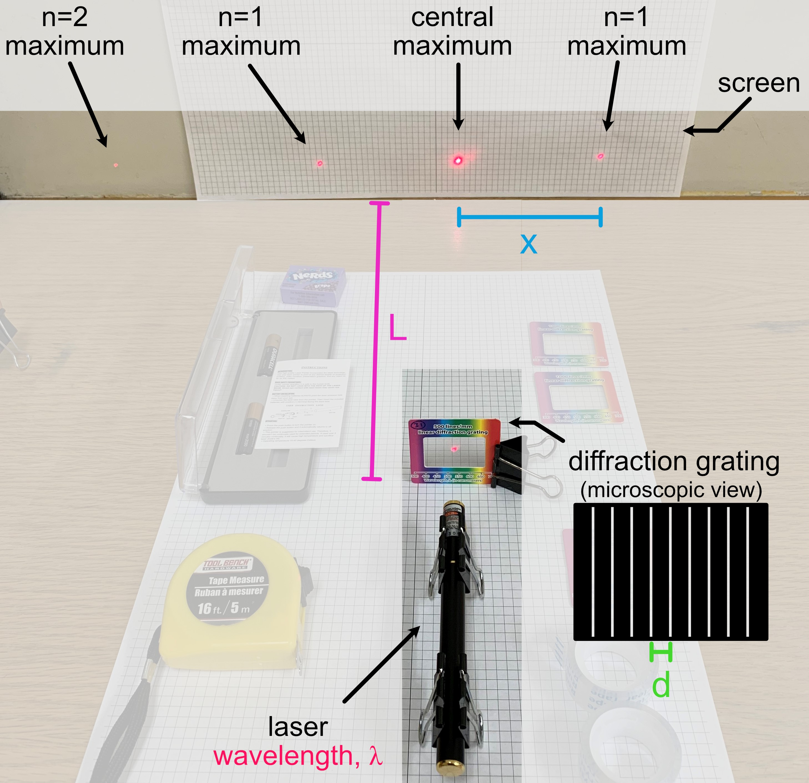

# Week 1: Exploratory Phase

--------------
1. [Background Theory](#background-theory)
2. [Summary of Key Formulae from Theory](#the-takeaway)
3. [Setting up your experiment](#setting-up-your-experiment)
4. [Exploratory Measurements](#exploratory-measurements) 
5. [Checkpoint 1](#checkpoint-1)

--------------

In this module you will be studying a light interference effect called <strong>diffraction</strong>. This phenomenon will allow you to measure the wavelength of visible light ($$ <10^{-6}$$ meters).

## Background Theory

Start by reading the [background theory for Module 3 here](background-theory){:target="_blank"}.

 

**Before moving on, make sure you have read through the background theory at the link above!**

  

## Module 3 Goal

In Module 3, we will use the relationship derived in the background theory to determine $$\lambda$$, the wavelength of the laser, by measuring $$x$$ and $$L$$ for the first diffraction maximum ($$n=1$$), and using the quoted value of $$d$$ for the provided diffraction grating:

\begin{equation}\label{eq:sYoung} 
\frac{xd}{L} = n \lambda
\end{equation}

#### Miniquestion 1: Spacing of Diffraction Gratings
*[Click here to open in a new tab](https://docs.google.com/forms/d/e/1FAIpQLScVy13Ddgurh38icYTvtZDd7mcRiIQcisnRfS6NIwLRf8om4Q/viewform?){:target="_blank"}*

<iframe src="https://docs.google.com/forms/d/e/1FAIpQLScVy13Ddgurh38icYTvtZDd7mcRiIQcisnRfS6NIwLRf8om4Q/viewform?embedded=true" width="640" height="400" frameborder="0" marginheight="0" marginwidth="0">Loading…
</iframe>

-----

#### Miniquestion 2: Spacing of Interference Maxima
*[Click here to open in a new tab](https://docs.google.com/forms/d/e/1FAIpQLSd0DalK3dCoRR8n6thQmaJmh4ctFmaWsDRalbRIW35mO1FA_w/viewform){:target="_blank"}*

<iframe src="https://docs.google.com/forms/d/e/1FAIpQLSd0DalK3dCoRR8n6thQmaJmh4ctFmaWsDRalbRIW35mO1FA_w/viewform?embedded=true" width="640" height="400" frameborder="0" marginheight="0" marginwidth="0">Loading…
</iframe>

## Setting Up Your Experiment

We will begin by setting up to do diffraction measurements. Find a room where you can turn out the lights and work in the dark. You will need a workspace with a vertical support such as a wall to which you can mount the grid paper we provided you with. Go ahead and mount the grid paper (e.g. tape it to a wall).

We don't want the laser light shooting across the room, please make sure when you set up your laser pointer that it is directed toward the wall with the mounted grid paper and not toward yourself or family members. But NEVER check this, or the alignment of the various items, by placing your eye directly in the laser beam path. Even if you are sure the laser is currently off, you should <strong>never look directly down the beam path.</strong>

We will begin by setting up the experiment. Attach one of the **500 lines/mm diffraction gratings** to the binder clip, as shown below. When handling the diffraction grating make sure to only touch the cardboard rim. Getting fingerprints on the region with the grating could affect your results.

A diffraction grating is essentially just an array of slits placed right next to each other, with a very small slit distance <em>d</em> between each (on the order of one slit per micron!). Each neighboring pair of slits can be thought of as a double slit. 

Use two additional binder clips to mount the laser as shown (making sure that the laser is pointing towards a wall/screen at all times when on):

Take note that you can position the binder clip in such a way as to keep the laser on while taking measurements (but remember to turn it off in between to conserve your batteries). **Turn off your laser when inserting new components into the beam path**; it is hard to make sure that stray reflections don't momentarily hit someone in the eye while inserting pieces of glass or metal into a beam path.

Position the diffraction grating between the laser and screen. 

You will want to use the grid paper and tape measure to measure the spacing between interference maxima as well as the distance of the diffraction grating from the screen. In planning your experiment you will want to think about how to do this as accurately as possible. What are the dominant sources of error. What can you do to minimize systematic error? Even when you've done your best to reduce systematic error, some will remain. What can you do to randomize the remaining systematic error? Why is this helpful?

For this module we expect you to set-up your own spreadsheet but if you start from the blank spreadsheet we've shared with you the sharing permissions will be set-up so that we can see your work [assigned from Google Classroom](https://classroom.google.com/c/MTI2NjQ0NDEyMTAx/a/MjAyODE1ODE3OTY5/details){:target="_blank"}. Organizing your spreadsheet carefully will make your work easier.

Think about which parameters correspond to $$x$$, $$L$$, and $$d$$ in your experimental set-up, as compared to the theory above. (You will find it helpful to notice that the number of slits per mm is written on the front of the diffraction grating). <strong>Make sure you are using one of the diffraction gratings with 500 lines/mm. </strong> Label each of your diffraction gratings, so you know which one you used this week. For example, write "A" or "B" in marker on the cardboard part of the diffraction gratings to label them.

## Exploratory Measurements

As in previous modules, you should perform the following exploratory measurements and record them in your [data sheet assigned from Google Classroom](https://classroom.google.com/c/MTI2NjQ0NDEyMTAx/a/MjAyODE1ODE3OTY5/details){:target="_blank"}

1. **perform a single measurement**
    + for a single $$L$$ measure $$x$$ and calculate $$\lambda$$; is your value reasonable? (e.g. is it between the value quoted on the sticker of the laser pointer 630-680 nm?) **Note that this is not how we will ultimately be determining lambda. Next week, we will begin data collection in earnest. This is just a quick check.**
    + what are the resolution uncertainty in your measured values of $$x$$ and $$L$$? which relative (fractional) resolution uncertainty is greater $$(\delta_\mathrm{res.} x)/x$$ or $$(\delta_\mathrm{res.} L)/L$$? 
2. **test repeatability**
    + at a fixed $$L$$, repeat the measurement of $$x$$ several times, fully resetting the experiment between each measurement
    + based on this, what is the dominant source of uncertainty: random or resolution?

3. **explore other factors** NOT SURE IF THIS IS STILL NEEDED, AND I DON'T KNOW WHAT THE MINIQUESTION IS ALL ABOUT
    + think of other variables you can change, make some preliminary observations of their effect
    + are you getting the same value of $$x$$ when you measure the 1st maximum to the left of the central maximum vs the 1st maximum to the right? 

#### Miniquestion $%&3: Exploring other factors SUGGEST REMOVING THIS
[*Click here to open in a new tab (recommended)*](https://forms.gle/NYhuVfiRRrmrzUi59){:target="_blank"}
<iframe src="https://docs.google.com/forms/d/e/1FAIpQLSe3T538QpIwC2e9FGaTT_T6NgMcHjHkPpaEdel3hD0dAHzAJw/viewform?embedded=true" width="640" height="400" frameborder="0" marginheight="0" marginwidth="0">Loading…
</iframe>

REPLACE WITH THIS:

#### Miniquestion 3: Calculating wavelength from slope
[*Click here to open in a new tab*](https://forms.gle/MPYx6nPVd54jYE359){:target="_blank"}
<iframe src="https://docs.google.com/forms/d/e/1FAIpQLSct57YgYJ1rxsHAkhGfOk_QUB638pb_MYeH7vhVZU2MGQUW5w/viewform?embedded=true" width="640" height="400" frameborder="0" marginheight="0" marginwidth="0">Loading…
</iframe>

 

## Investigating systematic errors

In previous semesters, students measured the wavelength of their laser using a 500 line/mm diffraction grating. Here are a few example measurements, with uncertainty:

$$\lambda$$ (nm) | $$\delta \lambda$$ (nm) 
----------- | ----------------
658	|18
672|	7
683	| 4
694| 	7
719|	8

We are all using the same materials, so why don't our results agree?!?!

This disagreement suggests there are important systematic effects in our measurement that we aren't accounting for. **This week, we will be trying to identify sources of systematic error, and then either account for them or "randomize" them.** 

Usually we don't have the benefit of having our experiment repeated by 150 other people at the same time to know that we should worry about systematic errors. This process of carefully thinking about systematic errors is one that we should always undertake with any experimental measurement, like we did in our [short discussion of systematic errors from Module 1](https://physics-50.github.io/Module-1/uncertainty-introduction.html#systematic-errors){:target="_blank"} and the careful consideration we made about [possible systematic errors in Module 2, Week 3](https://physics-50.github.io/Module-2/week3){:target="_blank"}.

Your Module 3 deliverable will be a sequence of figures that present both your main result (your measured value of $$\lambda$$), as well as an important a secondary result: a careful study of a significant systematic effect in the measurement.

Let's start by brainstorming possible sources of systematic uncertainty.

----------------------
SHOULD SOME OF WHAT IS IN THIS MINIQUESTION MOVE INTO THE MODULE ITSELF?
#### Miniquestion 4: Sources of Uncertainty
*[Click here to open in a new tab](https://docs.google.com/forms/d/e/1FAIpQLScTDcO7TOcD-Br6EJUJ-2eDNgBzZdDBPccsdrMRBBxRdxUZPg/viewform?){:target="_blank"}*

<iframe src="https://docs.google.com/forms/d/e/1FAIpQLScTDcO7TOcD-Br6EJUJ-2eDNgBzZdDBPccsdrMRBBxRdxUZPg/viewform?embedded=true" width="640" height="300" frameborder="0" marginheight="0" marginwidth="0">Loading…
</iframe>
------------------------------

I THINK WE NEED TO CUT ALL OF THE FOLLOWING:
********************** START CUTTING HERE ****************************
The kit you received includes five diffraction gratings for each of two different spacings.

When collecting data this week we would like you to take into consideration the sources of uncertainty just discussed and do your best to minimize uncertainty and randomize systematic error. 

We expect you to collect data this week with the two different spacings of diffraction grating that were provided and compare the results.

----------------------

#### Miniquestion 4: How do the diffraction patterns from the differently spaced diffraction gratings compare
*[Click here to open in a new tab](https://docs.google.com/forms/d/e/1FAIpQLScOvf4fEdEk5cotRGrTle0iitt7onz0DmTOdhuNL47lh2ifqA/viewform?){:target="_blank"}*

<iframe src="https://docs.google.com/forms/d/e/1FAIpQLScOvf4fEdEk5cotRGrTle0iitt7onz0DmTOdhuNL47lh2ifqA/viewform?embedded=true" width="640" height="300" frameborder="0" marginheight="0" marginwidth="0">Loading…
</iframe>

------------------------------

********************** END CUTTING HERE ****************************

THE BELOW SEEMS RIGHT BUT REQUIRES MUCH MORE DETAILED INSTRUCTIONS

As discussed in Miniquestion 4, there are several possible sources of systematic uncertainty that could be important in your measurements. One example is the effect of manufacturer variability in diffraction grating. Another is the effect of not having the laser beam perfectly perpendicular to the diffraction grating.

Choose one source of uncertainty that you believe to be significant and systematically explore its effect on the measured value of $$x$$. Think about how best to do this by systematically varying the parameter (eg. the angle of the laser beam, or the choice of diffraction grating). You should have about five different values of the parameter you vary (eg. angle or diffraction grating), and for each value of that parameter, you need to make five measurements of $$x$$ and report the average value of $$x \pm $$SEM. **NOT SURE IF ASKING THEM TO MAKE 5 MEASUREMENTS OF x AT EACH PARAMETER VALUE WILL RESULT IN REASONABLE ERROR BARS. WE HAVEN'T YET TAUGHT THEM ABOUT RESETTING EVERYTHING.** For each value of  Ultimately you will need to present the results of this exploration as a plot with $$x$$ on the vertical axis and the parameter you varied on the horizontal axis.

-------------

## Checkpoint 1

You should submit the following on Gradescope:

+ Results from your exploration of one source of uncertainty, presented as a figure with $$x$$ on the vertical axis, and the parameter you varied on the horizontal axis. Most of the time this is the best way to present scientific data, and it will help you prepare for our Module 3 deliverable.

+ A plot used to determine the wavelength of your laser for the 500 lines/mm grating. This plot must include the uncertainties on your data points and include a line of best fit that has been determined with a weighted fit. As always make sure to include units on your axis labels.

+ A plot used to determine the wavelength of your laser for the 1000 lines/mm grating. This plot must include the uncertainties on your data points and include a line of best fit that has been determined with a weighted fit. As always make sure to include units on your axis labels.

+ A plot showing the wavelength you determined as a function of diffraction grating spacing for the two spacings of diffraction grating you measured. Your results should include your propagated uncertainty in the wavelength as determined from your best fit line to the data you obtained for the position of interference maxima as a function of the separation of the diffraction grating from the screen.

+ A link to a spreadsheet with your experimental data

+ Do your measurements of the wavelength using two different diffraction gratings agree with each other and with the wavelength specified by the manufacturer [630-680nm](https://laserclassroom.com/product/standard-red-laser-pointer/){:target="_blank"}? If not what do you think might explain the discrepancy?

[Submit the results of your measurements on Gradescope](https://www.gradescope.com/courses/165932/assignments/809528){:target="_blank"}
-------------

When you're ready, please move on to [Week 2](week2).
