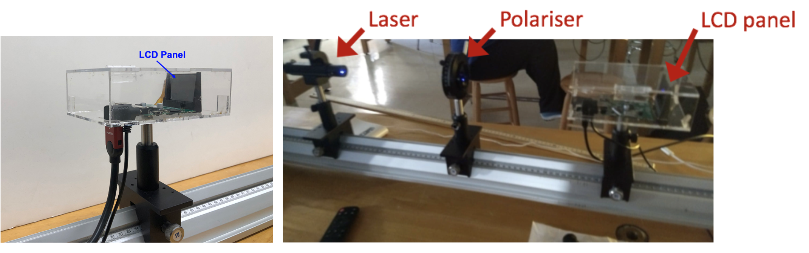

# Week 3

1. [Data Collection](#data-collection)
2. [Background on LCD Screens](#background-on-lcd-screens)
3. [Diffraction from an LCD](#in-lab-instructions-diffraction-from-an-lcd)
4. [Week 3 Summary of Data to be Collected](#week-3-summary-of-data-to-be-collected)
5. [Checkpoint 3](#checkpoint-3)

This week you will continue your investigation of the wavelength of your laser. We would like you to follow an identical procedure to last week. However, instead of using the 500 lines/mm gratings you should now collect data with the 1000 lines/mm gratings. Take a moment to reflect on expectations before diving into the experiment. How will the diffraction pattern change when the grating period is 1000 lines/mm?

#### Miniquestion 1: Comparing diffraction patterns from gratings with different periods
*[Click here to open in a new tab](https://docs.google.com/forms/d/e/1FAIpQLScOvf4fEdEk5cotRGrTle0iitt7onz0DmTOdhuNL47lh2ifqA/viewform?){:target="_blank"}*

<iframe src="https://docs.google.com/forms/d/e/1FAIpQLScOvf4fEdEk5cotRGrTle0iitt7onz0DmTOdhuNL47lh2ifqA/viewform?embedded=true" width="640" height="300" frameborder="0" marginheight="0" marginwidth="0">Loading…
</iframe>

## Data collection

Collect a set of data analogous to the data you collected last week but now using the 1000 line/mm gratings. This will give you the necessary data to complete this week's checkpoint. You should expect to spend the majority of your time in lab this week on this task.

As a reminder (repeat of last week's instructions):

To collect a complete $$x$$ vs. $$L$$ dataset, make sure to do the following:

+ Choose five values of $$L$$. Last week we recommended a range of $$L$$ values from about 15 cm to about 60 cm. You may find this more difficult when working with the 1000 lines/mm gratings as the $$x$$ values will be larger. You should still choose five $$L$$ values over as wide a range as you can in the space you have available. <!-- A range of $$L$$ values from 7.5 cm to 30 cm will give you a similar range of $$x$$ values to last week. -->

+ Collect five measurements of $$x$$ for each $$L$$ value, being sure to reset all the parameters you determined you needed to in  [Miniquestion 3 from Week 1](https://docs.google.com/forms/d/e/1FAIpQLSe-Bcw3iqEcmblnBnsOJOqSbfHVNrXckA4mVs9VEvzOXHvZQQ/viewform){:target="_blank"} between each measurement of $$x$$. Be sure to **only use the 1000 line/mm diffraction gratings.** 

+ For each $$L$$ value, compute the mean value of $$x$$ from your five trials and the random uncertainty as measured by the SEM. 

+ Enter your $$x\pm \delta x$$ and $$L$$ data into the MATLAB curve fitting script called "curve_fitting.m" from the [curve fitting guide](curve-fitting){:target="_blank"} and run the code to perform a best fit analysis.

+ You should make use of your data, the best fit analysis and the provided theory to determine the wavelength of your laser. You will need to use the methods you have been taught in previous modules to propagate uncertainty and determine the uncertainty in your final result. 

-----------------------------------

## Comparison of results from 500 lines/mm and 1000 lines/mm gratings

After you have collected and analyzed your data for the 1000 lines/mm grating we would like you to compare these results with the results you obtained last week using the 500 lines/mm grating. You will be asked to answer a question about your results on the checkpoint.

-------------

## Background on LCD screens

How does what we've learned in this module apply to an LCD screen? We can think of a liquid crystal display, or LCD, as being a two-dimensional diffraction grating.

To get a sense of what the diffraction pattern of a two-dimensional grating would look like, mount one of the 500 lines/mm gratings on the optical rail, and then mount a second grating, rotated at 90°. You do not need to collect any data; just describe in your lab notebook what the diffraction pattern from a 2-dimensional grid looks like.

A liquid crystal display consists of a two-dimensional grid of small 'boxes' called pixels (originally short for picture elements) that, together, display an image on a screen. These pixels are themselves composed of three 'sub-pixels' with colors red, green, and blue. If you look at your computer screen through a camera, you might be able to see the pixelated nature of the screen. Some common arrangements of pixels and sub-pixels in different devices are shown in the figure below. Voltages are applied across a pixel to control the colors and their relative intensities in that pixel.

 

LCD sub-pixel layouts for various types of screens.

You can think of the screen as a grid of windows with either red, green or blue glass, illuminated by a bright light from behind. Some mechanism -- perhaps a person adjusting the window shade -- determines how much light passes through each individual window. If you stand far enough away, an adjacent set of red, green, and blue windows is too small for you to see each color separately; instead you see a splotch of color made up of whatever red, green, and blue light is getting through that set of windows. Again, if you stand far enough away, the individual splotches blend together and you see a color picture made up of dots the size of each individual window. Your computer screen, and any LCD screen --such as the one on your phone-- for that matter, operate in a similar way, only the "windows" or pixels are on the order of tens to hundreds of micrometers wide. The more pixels a screen has per unit area, the greater the resolution of the screen, since there is more room for 'perfecting' the image on small scales.

Thus, you can think of the LCD as a two-dimensional grid of slits, where the distance between center of the 'slits' is the center-to-center pixel spacing, and is closely related to the resolution of the LCD screen.

When a laser beam strikes an LCD screen, the beam diffracts. If we set up a screen to observe the laser light reflected from the LCD screen, we observe a rectangular grid of bright dots, with roughly uniform spacing between maxima. By measuring the distance between these maxima and using the laser wavelength (determined in lab last week), you can determine the distance between the pixels, and thus deduce the resolution of the screen, by employing the same equation you used to determine the wavelength of your laser with the diffraction gratings.

## In Lab Instructions Diffraction from an LCD

Each station should have an LCD panel in an acrylic case that is fastened to an optical post and mounted on the optical rail, as shown in the figure below.

{:target="_blank"}

The HDMI cable that you will use to connect to your computer, as well as the power cable, are attached to the LCD panel. *Please do not attempt to unplug either of these cables from the acrylic box*. The LCD should be oriented so that the laser shines through it in a direction going from left to right in the figure above. **[PNS: this is really confusing]**

One of the goals for this exploration is to dissect (please do not take this literally!) the LCD panel,i.e. to deduce portions of its internal structure and to better understand how it works. 

In terms of deducing the internal structure, it would be nice to be able to 'look' inside. This is not so easy since the features of the LCD panel are quite small. However, humanity overcame this issue years ago when Hans and Zacharias Janssen invented the microscope. Below is a photo taken of our LCD screen via the eyepiece of a microscope. You are encouraged to observe the LCD screen under the microscope (through the eyepiece) in the rear of the lab. A microscope calibration slide is available that you can use to estimate the pixel size and compare with your results. You may find this helpful when assessing if your results are reasonable for the final question on the checkpoint.

 

**Note: the LCD that is pre-placed in the microscope is the same as those that are on your optical rail. Please do not disassemble your own LCD or its housing, and please do not touch the LCD screen.**

The LCD has structure that looks like a two-dimensional array of windows, or two-dimensional array of slits. In other words, it has a diffraction grating-like structure. It makes sense, then, that if we shine a laser through, there ought to be some sort of diffraction pattern.

Go ahead and mount the LCD on your optical rail and shine your laser through the LCD. You will see a bunch of bright dots, creating a rectangular grid, with uniform spacing between maxima. By measuring the distance between these maxima and given the laser wavelength (for the purpose of this estimate please use the value written on the laser itself not the value you measured. Make sure to take note of this value in your lab notebook), one can determine the distance between the pixels, and thus deduce the resolution of the screen, by employing the same equation used to determine the wavelength of your laser. 

If we wanted to work this out very precisely we would follow the full procedure of this module, collecting a careful set of data and plotting $$x$$ v.s. $$L$$ to accurately determine the pixel spacing, d (making use of the laser wavelength to do this calculation). **We do not expect you to do this. This is just an estimate. You only need to measure $$x$$ one time at a single $$L$$ value and estimate the pixel spacing from there.** You should do take a measurement in both the horizontal and vertical direction, but only need to take one measurement in each direction. Note that pixel spacing is the separation between a repeating unit. i.e. it would be for example the distance from the center of one of the red rectangles that you see to the center of the next red rectangle. 

This measurement, namely two measurements to allow you to estimate the pixel spacing in the x and y directions are the only data you need to collect with the LCD. This is intended to be a quick estimate, you do not need to estimate the uncertainty. You are encouraged to use remaining time to further explore the LCD panel. Before exploring you will find it helpful to [learn more about how LCDs work here](lcd-inner-workings). Once you have an idea how LCDs work, You can find some [suggestions for further exploration here](LCD){:target="_blank"}. Alternatively, you might find it interesting to take a look at your phone screen. By shining a laser at your phone and looking at the diffraction pattern of the reflected light you can probe the pixel structure of your phone. How does the pattern differ from that of the LCD screen from the projector? How does the pixel resolution compare?

## Summary of Data to be Collected

In lab this week you will need to collect the following data:

+ 5 measurements of $$x$$ at each of 5 different $$L$$ values (25 data points total), all measured with 1000 line/mm gratings.
+ a single measurement of $$x$$ in both the horizontal and vertical direction, each measured at a single $$L$$ value, from the LCD panel. You do not need to estimate the uncertainty.
+ It is also important that you take note of the laser wavelength as specified by the manufacturer. It is written on the laser itself. You will want this for comparison and also to use for calculating the pixel spacing.

## Checkpoint 3

If you had any issues with Checkpoint 2 we recommend speaking to an instructor before completing your checkpoint this week as it is very similar.

You should submit the following on Gradescope:

+ The plot used to determine the wavelength of your laser. This plot must include the uncertainties on your data points and include a line of best fit that has been determined with a weighted fit. As always, make sure to include units on your axis labels. You will be asked to upload this plot 3 times. You should upload the same plot each time. You do not need to write a caption.

+ A link to a spreadsheet with your experimental data.

+ The slope you obtained from your plot, including the uncertainty. 

+ The wavelength you have determined for your laser, with uncertainty from both the 500 line/mm gratings (last week's data) and 1000 line/mm gratings (this week's data).

+ An answer to the question: Would you feel comfortable using these two wavelength values ? If not what do you think might be going on and what are you going to do about it?

+ An estimate of the pixel spacing for the LCD screen. It is only an estimate, please make use of the wavelength written on the laser itself and not your experimental value for this estimate. You do not need to estimate the uncertainty. 

It may be that you have done very careful experimental work and your results still are not in agreement. We will explore this more next week.

<!--
## Grading rubric

This checkpoint will be graded out of 14 points. 

+ The grading rubric for the first three questions (results for the 1000 lines/mm grating) will be analogous to those for checkpoint #2. Please come talk to office hours and ask question if there is anything you are unsure about. 

+ Question 4 (comparison of results from two different grating spacings) will be graded on both your results and figure mechanics

+ Question 5 (agreement of results). We are only looking for a single sentence indicating whether your wavelengths are in agreement.

-->

## Mini-questions:

And to double-check, make sure you have finished all of this week's mini-questions by [checking here](mini-questions#week-3){:target="_blank"}.
