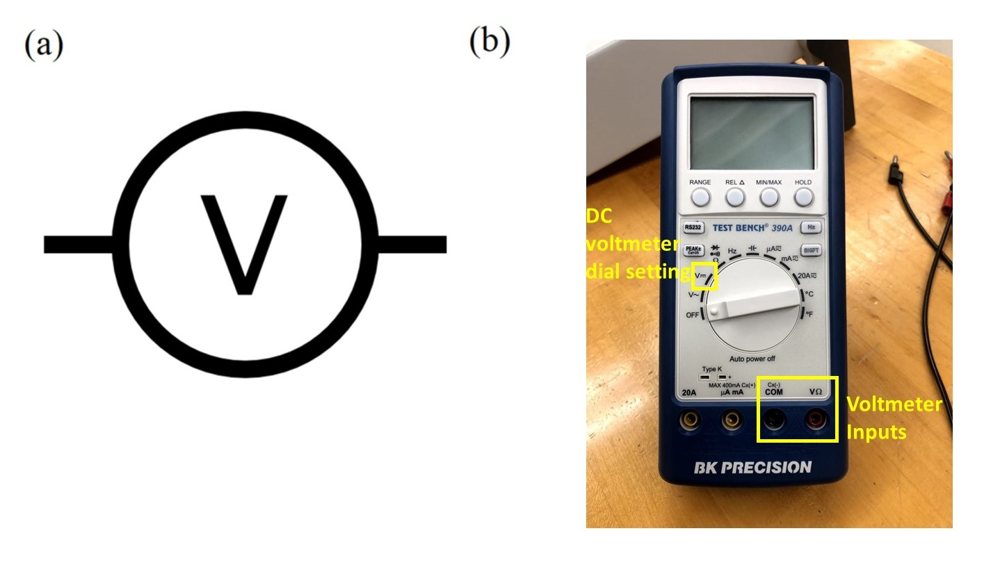

# Module 3 Week 1 During Lab

## Goals for This Week

Your goals this week are to become familiar with a solar panel circuit and the data-taking process, characterize the solar panel's performance under good lighting conditions, and get ideas for what kind of systematic investigation in Weeks 2-3 could be interesting and informative.

First you will set up a circuit to connect your solar panel to a variable load resistance, while including multimeters to measure the current through the load and voltage across the load.  You will collect data by varying load resistance and plot an I-V curve for your panel when it is fully illuminated by the grow light at your station.  You will determine $$I_{sc}$$, $$V_{oc}$$, and $$P_{max}$$ from your data.  This process will give you an idea of how to efficiently collect the relevant data, as well as what factors cause the most uncertainty in your determination of the three key quantities.

Next, you will vary the lighting conditions in some (single) way, and characterize the performance of your solar panel under the new conditions.  You will share results with the rest of your class, and from there begin to design a systematic investigation to undertake in Weeks 2-3.

## Instrumentation

Using cables available at your station, connect your solar panel to a variable load along with an _ammeter_ to measure current and a _voltmeter_ to measure voltage.  The circuit you should create is shown schematically below, but we will also go one-by-one through the circuit symbols and the actual pieces of equipment they represent.

The figure above shows the circuit schematic for measuring the $$I-V$$ curve of a solar panel, shown as a gray rectangle.  A variable resistor provides the load, a voltmeter measure the voltage across the load, and an ammeter measures the current flowing through the load.

To operate your panel, slide the solar panel into the gap at the bottom of the black plastic light box, with solar cells facing up, and turn on the grow light in the top of the box:

In the image on the right above, the solar panel still needs to be pushed a few more inches so that it fits entirely within the light box.  The grow light provides a standardized source of illumination, and the black box isolates the panel from variations in external room lighting.   

By convention red and black denote places current will flow from and to, respectively, so you should connect the red lead of the solar panel output to the load resistor, following the circuit schematic at the beginning of this section.

A load with variable resistance will be provided by a decade resistance box, shown in the figure below:

Part (a) above shows the circuit schematic symbol for a resistor.  Part (b) shows the symbol for a variable resistor, and part (c) shows the actual resistor box you will use in the lab.  You may have learned in the the past that it is dangerous to connect a circuit with a load resistance of zero.  This is true for many power sources, which may try -- and fail -- to produce infinite current when presented with zero resistance.  Because our solar panels have another factor (number of photons absorbed per second) limiting their maximum current output, **it is not dangerous to set the load resistance to zero in this particular circuit**.

For the voltmeter and ammeter in your circuit, you will use two different _digital multimeters_, instruments that can be set to measure a variety of electrical properties of a circuit or individual device.  

To measure current, you will use the desktop multimeter pictured below:

Part (a) above shows the circuit schematic symbol for an ammeter, while part (b) shows the instrument you will use.  Power on the multimeter and press the "Shift" and "DC V" buttons to set it to measure DC current (see blue "DC I" above the "DC V" button).  There are two red current ports labeled with the max amount of current they can measure:  500 mA and 20 A.  You can start out by using the 20A port, but switch to the 500 mA port for greater sensitivity if the currents you observe are low enough.  Current coming from the load should be connected to the appropriate red current input of the ammeter.  Current will then flow through the ammeter and out the black COM port, which should be connected to the black lead of the solar panel to complete your circuit.

This is a good time to set up your circuit the with solar panel, load, and ammeter all in a single loop, or _in series_ with each other, so current flows through each in turn.  Make sure the ammeter is reading a current (in units of A or mA).

The last component you will add is your voltmeter.  For this purpose you will use a handheld multimeter like the one pictured below:

Part (a) above shows the circuit schematic symbol for a voltmeter, while part (b) shows the instrument you will use.  Power on the voltmeter by turning the dial to measure DC voltage, as indicated in the picture.  Since voltage is the energy change per unit charge in going from one point in a circuit to another, a voltmeter must be connected to two different points on the outside of an already complete circuit loop.  This is called connecting it _in parallel_ with the rest of the circuit.  You will connect your voltmeter leads to the two sides of your load as shown below:  

Make sure your voltmeter is reading a voltage (in units of V or mV).  Be aware that either of your meters may autoscale as the current and voltage values change; make sure to pay attention to the units on the displays so that you are recording current and voltage accurately.  After it has been powered on for a long time, the voltmeter might beep and possibly turn itself off, but you can always just turn the dial to off and then back to DC volts.

## Data Collection

With your circuit complete, both meters powered on and set correctly, and your grow light fully illuminating your solar panel, now you will measure the I-V curve of your solar panel. To do measure the I-V curve, vary the load resistance and record current and voltage values at different load resistances.  To make the best use of your time, you may want to start by increasing or decreasing your load resistance by a factor of ten at a time, until you have an idea of roughly what resistance is "very large" for this solar panel -- i.e., large enough to make the current start nosediving toward zero.  You can then take a modest number of data points at "very large" and "very small" resistance values, but focus on intermediate resistances in order to find $$P_{max}$$.  

To help guide your data taking, set up your Google Sheet to make a scatter chart of $$I$$ vs. $$V$$ values as you enter data.  For instructions on how to do this, see [here](https://support.google.com/docs/answer/9143294){:target="_blank"} and [here](https://support.google.com/docs/answer/63824){:target="_blank"}, or talk to a classmate or instructor.

Your data collection for this fully-illuminated solar panel should be complete by the end of the first hour of lab.  After that, you will move on to an exploration of what happens when part of the solar panel is shaded, or the light illuminating it is dimmed.  We have provided you with black cardboard, scissors, and tape.  Use them to cover portions of your solar panel and/or grow light, and record what you have done using the template images in your lab notebook Google Doc.  Repeat your data collection to find an I-V curve and key performance metrics for this new lighting situation.  

At the end of lab this week, all lab groups will share your explorations and results with each other.  As you consider your own results and those of your classmates, think about what systematic investigation you might undertake in Weeks 2-3.  In your systematic investigation, you will adjust some feature of the lighting/shading situation for your solar panel while holding other factors constant.  Your goal will be to study how your solar panel's performance -- characterized by $$P_{max}$$ or perhaps one of the other metrics you have learned about this week -- varies as a function of the quantity you changed.
