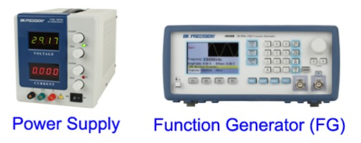
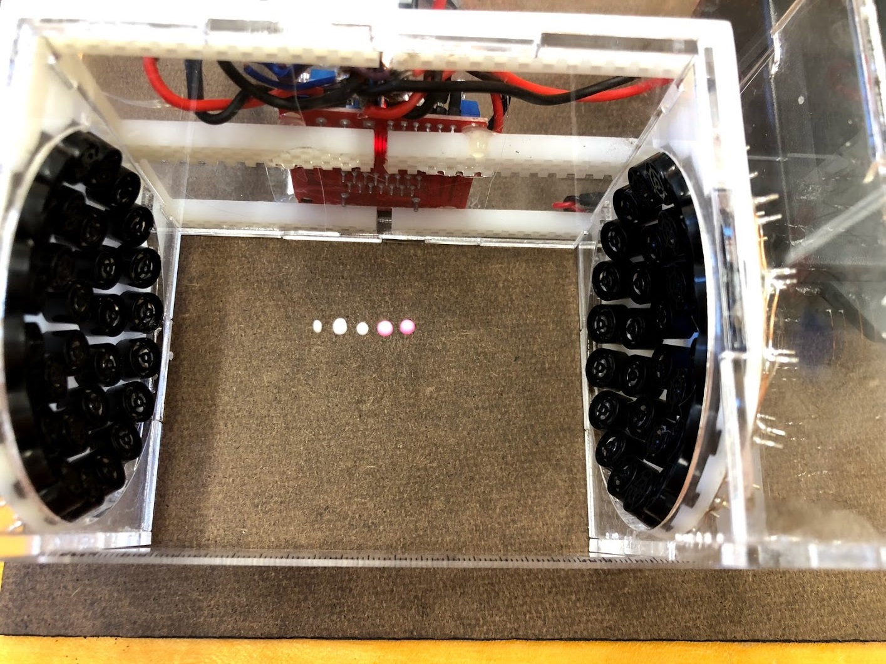
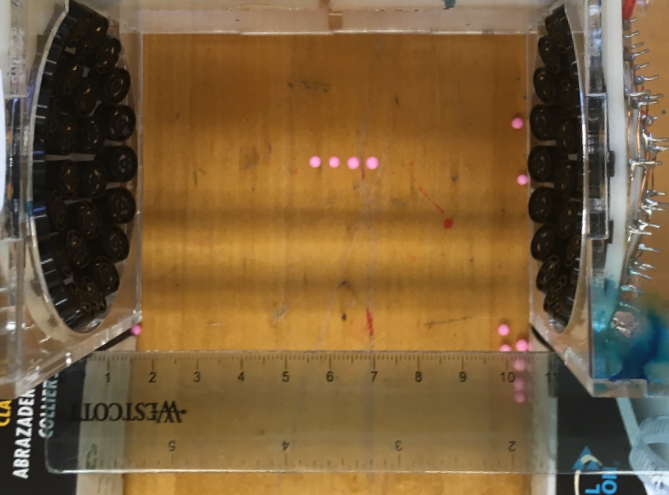

# Week 1: Exploratory Phase

--------------
1. [Introduction](#introduction)
2. [Background Reading](#background-reading)
3. [Week 1 Instructions](#week-1-instructions)
4. [Summary: What you need to leave lab with today](#summary-of-what-you-need-to-leave-lab-with-today)
5. [Checkpoint Instructions](#module-2-checkpoint-1)
6. [References](#references)

--------------

### Introduction
In this module we will be working with a rather cool piece of home-built equipment, an acoustic levitator! We will be doing far more than floating objects, however. We will also continue to hone in on one of the most important skills, some may say arts, of an experimentalist: performing accurate and precise measurements. This may not sound all that exciting at face value but it is an incredibly important part of experimental science. The GPS on my phone may be able to tell me my location on a map, but how useful would it be if it was only certain to a radius of 5 miles? Or what if it was consistently reporting a location that was 1 mile to the east of my actual location? Understanding how well we <em>truly</em> know the value of something, being able to increase the accuracy to be useful for our application, and being certain that we are actually measuring what we think we are measuring are fundamental to good scientific practice.

### Background Reading
This week in lab you will be working with a standing wave of sound to levitate small objects (cool!). Let us take a few minutes to understand how they work.

#### A Brief Review of Standing Waves
The acoustic levitators we will use in lab make use of standing waves of sound. Let us harken back to Physics 24 for a brief review of the basics of standing waves.

As you may recall, in a transverse wave the disturbance away from equilibrium, y, in a wave traveling in the x direction can be described by the equation $$y=A \sin(k x-\omega t)=A \sin[2\pi(\frac{x}{\lambda}-\nu t)]$$ where $$ A$$ is the maximum amplitude, $$ \nu=\frac{\omega}{2\pi}$$ is the frequency (that's Greek "nu"), and $$\lambda$$ is the wavelength of the wave. The speed $$ v$$ of the wave is given by $$v=\lambda \nu.$$

In the case of a wave on a string the wave travels along the length of the string and the disturbance $$ y $$ is the displacement of bits of string perpendicular to the length. Imagine a string tied at one end to a fixed spot on a post, held under constant tension and attached at the other end to a mechanical oscillator that jiggles the string. The oscillator creates a sine wave that propagates towards the fixed end, where it reflects, creating another sine wave that propagates back toward the oscillator in the opposite direction. We now have two waves traveling in opposite directions and what we observe will be the result of these two waves added together.

Recall that the superposition of two waves traveling in opposite directions can be represented by
\begin{equation}
 y_{\rm total}(x,t)=A \sin(k x-\omega t) + A \sin(k x+\omega t +\phi)
\end{equation}
where the reflected wave has the same maximum amplitude as the incident wave but has picked up a phase $$ \phi$$. Reflection off a fixed end as described above causes a phase shift of $$\phi=\pi$$.  Our combined wave can now be represented as
\begin{equation}
  y_{\rm total}(x,t)=A \sin(k x-\omega t) - A \sin(k x+\omega t )
\end{equation}
where we have made use of the fact that $$ \sin(\theta+\pi) = -\sin(\theta)$$. By using the trig identity $$ \sin(A + B)=\sin(A)\cos(B)+\sin(B)\cos(A)$$ and a little bit of algebra, you can show that this simplifies to $$y_{\rm total}(x,t)=-2A \sin(\omega t)\cos(kx)$$.

The takeaway from this is that the position and time dependence are now separate! It is as though the wave is fixed in space along the $$ x $$ axis while the effective "maximum amplitude" oscillates in time as $$ 2 A \sin(\omega t)$$. This is known as a **standing wave** and is shown in the figure below.

Above is a  standing wave formed by counter-propagating sine waves. The blue standing wave is the sum of the upper two traveling waves. Animation courtesy of D. Russell.

If both ends of the string are fixed (picture a plucked guitar string), then the standing wave must have **nodes** at each end of the string, where the string stays put and doesn't oscillate up and down. In between the nodes, there must be an integer number of **antinodes** where the string oscillates with maximum amplitude. That means that there must be an integer number of half-wavelengths that fit within the length $$L$$ of the string. Thus, only certain wavelengths (and therefore frequencies) will produce stable standing waves. These special frequencies are called **resonant** frequencies. At other frequencies, the vibrations on the string will be unstable and tend to die out.
<!--- If both ends of the string are fixed (or nearly so), this puts restrictions on the wavelengths and therefore the frequencies that will produce stable standing waves on a given string. In this example, our string can be thought of as having two fixed ends **—nodes—**a distance $$ L $$ apart.  The places where the string doesn’t move ($$ y_{\rm total}=0$$) are called **nodes**, whereas places where the string oscillates with maximum amplitude are called **antinodes**. Only particular wavelengths will allow both ends of the string to be nodes; the wavelengths and frequencies that produce this type of stable standing waves are called **resonant.** (Note:  We have arrived at this condition by considering the boundary conditions for the disturbance at the ends of the string.  An equivalent method would be to require that the twice-reflected wave after one round trip is perfectly in phase with the brand new wave just now being emitted by the oscillator.  This second method offers some insight into what happens when the oscillator frequency is <em>not</em> resonant:  the vibrations on the string will be unstable and tend to die out.)--->

What happens if instead of a fixed end we have a second mechanical oscillator shaking the string at the same frequency? We will end up with a standing wave but the ends will not be nodes and it will not be defined by a resonant condition, meaning we are free to pick any frequency. This is the situation we have in the acoustic resonator.

<!--If you wish to revisit the above concepts, consult Appendix D of <a href="https://edge.edx.org/courses/HarveyMuddX/PHYS024x/2015_Spring/" target="_blank" rel="noopener"><em>Motion II</em></a> by Prof. Helliwell.-->

### Acoustic Levitator Theory

Air surrounds us all the time and it’s easy not to think about it at all, or to think of it as insubstantial.  But when a gust of wind blows over our beach umbrella, or a vacuum cleaner sucks up dust (or confetti, or popcorn…), it’s hard to ignore the fact that air molecules can exert force on other objects.  Specifically, these phenomena and many others involve net motion of many air molecules in response to a pressure difference.  In the case of the wind at the beach, the original pressure difference may be caused by weather patterns and by the contrasting temperature and motion of the water compared to the land.  In the case of the vacuum cleaner, the original pressure difference is caused by the vacuum action pulling air out of the canister.  Either way, air moves in response to the original disturbance, and can push solid objects as it goes.  Sound travels through air in a similar manner.  You bang on the table, and the table (and your hand) vibrates. These vibrations jiggle the nearby air, causing a pressure wave in the air that outward and eventually vibrates your eardrums, which your ‘microphones’ (i.e., eardrums) interpret as a sharp bang.

Given that sound is vibrations of the air, might sound waves push and even levitate solid objects?  Indeed, this is the phenomenon of acoustic levitation, or ‘acoustophoresis,’ in which sound floats material objects.  The forces here are a bit more complicated than in the case of the beach umbrella or vacuum cleaner.  Both of those examples involved a steady or long-lasting pressure difference causing a sustained motion of the air in one direction.  As a sound wave passes through the air, however, the pressure in any given spot oscillates between high and low many times per second, but the vibrating air can still exert an overall force called acoustic radiation pressure. We’ll discuss in more detail the various ingredients that go into acoustic levitation in a standing wave of sound.

First we’ll discuss the generation and propagation of a traveling wave of sound. Consider the following thought experiment. There is a speaker placed on a table, so that sound projects from the speaker to the ceiling. Suppose the speaker is attached to a function generator, and so outputs a noise with a constant frequency. The speaker operates by vibrating a “plate” up and down at the frequency set by the function generator, thus creating regular disturbances in the air, which your eardrums interpret as sound. These disturbances are longitudinal waves, unlike the transverse waves we imagined on a string earlier. Whereas a transverse wave vibrates in the direction perpendicular to the direction along which the wave is moving, longitudinal waves vibrate in the direction along the direction of motion of the wave. These distinctions are hopefully made clear by the following two animations. The left is a transverse wave while the right is a longitudinal wave like sound:

Above are animations of transverse (left) and longitudinal (right) travelling waves. Note the difference in the behavior of individual particles in each wave type. Sound waves are longitudinal and look like the right-hand picture. Animation credit D. Russell.

Electromagnetic waves are transverse, as are tsunamis in the open ocean. However, tsunami waves at the shore and slinky compression waves are longitudinal, as are sound waves.

Fun fact! The waves you see at the surface of the water in the ocean, those which “break” at the beach, are called surface or circular waves since particles in them effectively move in circles, and are neither longitudinal nor transverse, but rather a combination of the two as illustrated above.

Now, the longitudinal waves created above the speaker have a regular pressure pattern. When the plate in the speaker is forced downwards, the air directly above the speaker is “pulled” apart, creating a low pressure, or “rarefaction,” region. But when the plate is accelerated upwards, the air above is “squeezed” together, forming a high pressure, or “compression,” region. As individual air molecules move and collide, the pressure variations propagate upward as a traveling wave of sound.

We learned in the previous section that traveling waves of the same frequency, moving through the same material in opposite directions, can form a standing wave. This can happen for sound as well.

The sinusoidal waves shown in the figure below represent the pattern of pressure variations in the air; they also look exactly like the geometric shape of the string in our thought experiment above. However, because sound waves are longitudinal, the actual motion of the air molecules looks geometrically a little different as shown in the figure below.

The above animation shows a standing pressure wave that is oscillating at its resonance frequency. In the left animation we see the air particles being driven back and forth, creating regions of high and low pressure. The middle animation shows the displacement from equilibrium of a particle as a function of position. The right animation represents the deviation from equilibrium pressure as a function of position. Note this pressure wave is oscillating about the equilibrium pressure, not zero pressure. Notice the motion of the red particles for various locations and how the displacement and pressure animations relate to that motion.

In the previous section the standing wave on a string was caused by a traveling wave in one direction, driven by a source, and the reflections of this original traveling wave at the ends of the string.  A standing wave of sound can be created in the same way, using a single traveling-wave source like a speaker at one end of the setup and a sound reflector, like a metal plate, at the other.  Standing waves set up in this way are called resonant standing waves.  In a given setup, they are possible only at certain frequencies because the reflected waves have to interfere in just the right way with one another – or to put it another way, an integer number of half-wavelengths must fit along the length of the setup.  However, at the right wavelengths or frequencies, resonant standing waves can be very strong even if the original driving source is relatively weak; the reason is again that resonant standing waves involve constructive interference of the original wave with the waves that have gone before it and completed one round trip, or two round trips (etc.), through the setup.

Resonant standing waves of sound are very common.  (To play with some, consult a friend with just about any non-electronic musical instrument.)  However, our setup this week will involve **non-resonant standing waves** of sound.  Remember that the key ingredients for a standing wave are two traveling waves in opposite directions. In a non-resonant standing wave, we simply place one source at either end of the setup.  If the two sources are driven together---by the same signal---they will produce traveling waves in opposite directions, of equal frequencies and amplitudes, creating a standing wave.  In a non-resonant standing wave, reflections of the original traveling waves are not crucial.  Therefore, there are no specific frequency or wavelength requirements to make a standing wave “work” in the setup (i.e., no harmonics). However, since the original traveling waves don’t get “reused” in the setup through multiple reflections, a non-resonant standing wave is generally not very strong unless the driving source itself is strong. You will see both of these features of non-resonant standing waves in the apparatus you will use this week.

In our acoustic levitator apparatus, the two sources are two sets of tiny speakers driven by the same electrical signal.  Each speaker set is arranged in a slightly concave bowl-like shape, and the two bowls face each other on opposite ends of a plastic frame.  The curved, concave shape of each source is a detail we haven’t yet discussed.  Its purpose is to shape the standing waves, making them focused and strongest in the middle of the apparatus.  The same thing is very commonly done for standing waves of light, with pairs of curved mirrors.  You can get a rough idea of how the curved surfaces produce curved wave patterns in the second half of <a href="https://www.youtube.com/watch?v=tVWemRbgLW4">this</a> video.

How does a standing wave of sound produce acoustic levitation?  Take a good look at the standing wave in the previous figure .  A standing wave of sound consists of “pressure antinodes,” fixed positions in space where the pressure <em>deviates the most from the equilibrium</em>, atmospheric value, and “pressure nodes,” fixed positions in space where the <em>pressure stays constant</em>.  You might imagine a small styrofoam bead placed in the standing wave, being pushed away from a pressure antinode when the pressure is high there, and then being pulled toward it when the pressure is low there.  This doesn’t sound like it creates stable trapping!  However, the key to acoustic radiation pressure is that the standing waves oscillate too fast for a big, heavy particle (even a styrofoam bead) to follow the cycles of push and pull in a simple way.  Instead, the air in each region pushes the particle with an effective force proportional to the time average of the square of the pressure, $$ \langle p^2 \rangle $$.  There is a well-developed theoretical foundation for this force (see Gorkov, 1961 and Marzo *et al*, 2017) but we will not go into it here.  What’s important to note for now is that $$ \langle p^2 \rangle $$ is larger at the pressure antinodes than at the pressure nodes, so particles are consistently pushed either to the pressure nodes or to the pressure antinodes.  Most solid particles are pushed to (and trapped in) the pressure nodes; the exact details depend on the density of the object compared to air and the speed of sound through the object.

### Week 1 Instructions
By the end of the day today you will be able to successfully levitate, using sound waves, small polystyrene beads! You will make a preliminary measurement of the speed of sound in air by measuring the separations between suspended beads, and you will have performed a preliminary investigation of sources of systematic error in the experiment.

Our first goal is to create a standing wave with the acoustic levitator. The speakers create sound by exerting force on the air. To create sound of a given pitch, or frequency, the speaker pushes the air back and forth in a repeating pattern at that frequency. The exact pattern — sinusoidally varying force, short bursts, or something else — influences the timbre of the sound produced. Our speakers are piezos, or piezoelectrics, meaning that applying a potential difference across the speaker will result in the speaker exerting a force on the air. If we want the speaker to create a tone, we need to give it a periodic signal. A **function generator**, shown below and abbreviated as “FG”-- is a piece of equipment that creates periodic signals.

{:target="_blank"}

A function generator’s waveform, frequency, amplitude and offset are set in the following manner:

+ Turn on the function generator
+ Select the waveform using the buttons to the right of the display
    + Adjust the FREQUENCY using the F1 button on the function generator. Use the number pad to type in the numerical frequency desired followed by pressing the button with the appropriate units (Hz, kHz, MHz) to the right of the numbers; press enter when done. Note: If you would only like to adjust the frequency a bit from its present value you can also use the dial.
    + Adjust the AMPLITUDE and OFFSET settings using the F2 and F3 buttons. Again, use the number pad to type in your desired value followed by the units; press enter.
    + Press the "ON" button above the output of the function generator to make sure it is ON (illuminated).

You can go ahead and turn on the function generator and set it now. For this experiment, **set the function generator (FG) to create a 40 kHz SQUARE wave with amplitude 5 V and offset 2.5 V**. “Amplitude” for the FG means peak to peak voltage variation of the signal. The speakers are designed to work best at 40 kHz, and beads will only levitate stably if you use a square wave, not a sinusoidal wave. **Don't forget to press the ON button** above the output port.

#### Powering the Acoustic Levitator
Let’s turn our electric signal into a sound wave! Ensure that the switch on the levitator is set to “AMP.” Be careful, as the switch has 3 possible positions, and you want to set it all the way to “AMP.” This sets the output from the FG to go through a digital driver. A digital driver sets the potential difference at its output to one of two things: either 0 V, or the voltage supplied by the power supply (labeled PS OUTPUT (+)). The voltage on the logic inputs determines which of these two options is outputted. In our setup, the square wave output of the function generator is connected to the logic inputs. Thus, the output of the driver will be a square wave oscillating at the same frequency as the function generator, switching between 0 V and the power supply output voltage.

The above image shows a schematic of the driver used in our circuit “L298N Motor Drive Controller Board.” This board is actually able to drive two devices with outputs A and B. We will only be using one in our circuit. “PS OUTPUT(+)” is the connection to the positive power supply output and “PS GND” is the power supply ground.

Connect one end of a BNC cable to the FG output. Plug the other end into the “FG” input on the case of the levitator as shown below. Do not connect the power supply.

The above image shows the back of the levitator. The inputs for both the function generator and power supply are highlighted. There should already be BNC cables attached to both of these in your apparatus.

Safety Warning: Whenever you are connecting elements in a circuit, make sure the power supply and function generator output are off. Do not turn on the power supply until you have completed the circuit.

With the power supply turned off ensure that the negative (–, black) terminal on the power supply is connected to the ground (GND, green) terminal. This simple connection ensures that the levitator apparatus, power supply and function generator all have a common ground. If there is no metal clip connecting the black and green terminals, notify your instructor and together you can make this connection with a small piece of wire.

Using a BNC/banana adapter, connect the red banana connector to the red positive (+) output on the power supply and the black banana connector to the ground (green) output of the power supply. Connect the output of this adapter to the BNC cable already plugged in to the “PS” input on the levitator case.

Safety Tip: Never touch the leads of the power supply together! This will short circuit the power supply and could damage it. The power supply will click if it has been short circuited. The voltage has to be constant throughout a wire — there’s nothing to change it. The power supply has internal electronics to create a voltage difference across its two terminals. If you connect the two terminals with a wire, you force the terminals to be the same potential, so something must change inside the power supply to allow this to happen.

The L298N Motor Drive Controller Board has on-board logic that needs to be powered at 5V. This is separate from the power supply voltage that will pass through the PS terminal. The 5V logic supply input is connected to a USB connector. You should plug the USB terminal in to one of the wall outlets on your bench. A red light on the L298N board will turn on.

Before turning on the power supply, double check all connections, and turn all the knobs on the power supply to zero (all the way counterclockwise). Now turn on the power supply. The light labeled C.V. (coarse voltage) should be green, meaning that the output of the power supply is limited by the voltage dial settings. Make sure the function generator is turned on and the output light is on. Turn the coarse dial for the voltage slowly up (clockwise). Observe that the voltage reading on the front panel of the power supply rises, but the current stays at zero. The power supply might make clicking sounds - this is okay. 

When you reach a voltage output of around 6-10 volts, the current will start to rise, the green C.V. light will go off and the red C.C. light will go on. At this point both the current and the voltage will stop rising in response to further increases of the coarse voltage dial. The red C.C. light indicates that the power supply output is now being limited by the current dial settings. Turn the coarse current dial up until the green C.V. light comes back on. Alternate between increasing the voltage setting and the current setting as necessary until you have reached an output voltage between 12 V--14 V. Do not exceed 15 V. Keep an eye on how much current the power supply is providing. **If it goes above 225 mA (0.225 A) turn the power supply off** and check your circuit or ask an instructor. 

### Levitating a Bead
Now let's try to levitate a styrofoam bead! See the following [video for instructions on how to load a bead into the levitator](https://youtu.be/YrpVdlcYu7Y){:target="_blank"}.

Place a few beads on a lens wipe or dryer sheet and move them around between the speakers of the acoustic levitator until they hop into position. This should not be too difficult. If the bead doesn't stay, double check all your connections, the function generator settings (including if the output is on), and that the light on the driver is on. Ask an instructor if problems persist.

### Collecting data

You have two main goals this week: first, you will practice levitating beads and reach a point where both partners can comfortably levitate beads for data collection. Second, you will collect sufficient exploratory data to make a preliminary estimate of the speed of sound.

The basic strategy for determining the speed of sound using your acoustic levitator is as follows:

+ Place beads in the levitator. Using the provided materials and recommended parameters, you can trap one bead at each node position.
+ Each node is separated from the neighboring node by one half wavelength.
+ You will take a photo of the beads and digitally measure the distance between the nodes to compute the wavelength $$\lambda$$. This requires knowing the size of each pixel in the camera image, so you will need to include a ruler or something similar to calibrate the camera pixel size in the image you take.
+ You know the frequency $$\nu$$ of the wave, because you have set it with the function generator.
+ You can compute the speed of sound from $$v = \lambda \nu$$.

You have several methods at your disposal to make your measurements. There are calipers, rulers, and cameras available in the lab. You can try directly reading the separation with the calipers:

[Click here for instructions on using the calipers](caliper)

However, you will most likely find it difficult to get a reliable reading as you cannot bring the calipers close to the beads without disturbing them. 

To combat this, you will collect your data by positioning a camera near the levitator and taking a picture. However, it is important that you have a plan to convert from a distance between beads in pixels to a measure of their separation in mm; this is much like adding the scale bar in your Module 1 deliverable. You will need a ruler in your image whose markings you can use to compute the conversion factor, and you will want to think about how best to position your ruler. 

If you think of materials around the lab that might be helpful, ask your instructor if you can use these materials. Creativity is encouraged!

--------------

## Setting up the camera to take a picture of the levitated beads

The provided cell phone camera mount, mounted to a vertical pole, can be used to position your cell phone near the acoustic levitator to take pictures of the beads for analysis. Make sure to include a ruler in the image for calibration purposes and give some thought to the best positioning of the ruler for accurate results.

### Preliminary Data Analysis

It is helpful to begin your exploratory analysis with a back-of-the-envelope estimate. Go ahead and make use of the measured spacing between beads to estimate the speed of sound. It is difficult to get a good estimate by directly measuring the distance between beads. Instead try the following:

1. Take a picture of levitated beads. Your picture should also include a ruler for calibration. 

2. Determine the separation between beads in pixels.

3. Use the ruler to determine a conversion factor from pixels to millimeters.

4. Use the measured separation between nodes to determine the speed of sound.

Let’s practice with a mini-question. Please download the following image of levitated beads and use it to answer the mini-question. Make sure to download it at full resolution.

**Click on the images below to enlarge in a new tab and download the image:**

{:target="_blank"}

--------------------------------------------------------

<!--#### Miniquestion 1: Image Calibration
[*Click here to open in a new tab*](https://docs.google.com/forms/d/e/1FAIpQLSeGfXJTqX8XZ1wKmUYtHE1oWlXGIhBalvSH6U20WFP1P6jCMg/viewform?usp=sf_link){:target="_blank"}

<iframe src="https://docs.google.com/forms/d/e/1FAIpQLSeGfXJTqX8XZ1wKmUYtHE1oWlXGIhBalvSH6U20WFP1P6jCMg/viewform?embedded=true" width="640" height="300" frameborder="0" marginheight="0" marginwidth="0">Loading…
</iframe>

---------------------->

#### Miniquestion 1: Practice Calculation - Bead Separation
[*Click here to open in a new tab*](https://docs.google.com/forms/d/e/1FAIpQLSfcHYM0EXRutwU9snAkMcDvZ4mAs_osQWJDzQbT2q6VGvlNgg/viewform?usp=sf_link){:target="_blank"}

<iframe src="https://docs.google.com/forms/d/e/1FAIpQLSfcHYM0EXRutwU9snAkMcDvZ4mAs_osQWJDzQbT2q6VGvlNgg/viewform?embedded=true" width="640" height="300" frameborder="0" marginheight="0" marginwidth="0">Loading…
</iframe>

---------
#### Miniquestion 2: Practice Calculation - Speed of Sound
[*Click here to open in a new tab*](https://docs.google.com/forms/d/e/1FAIpQLSci324tKy0cSjFai2_doq3CFVgnK8_hwKeITrPGGVYvgSBB1A/viewform?usp=sf_link){:target="_blank"}

<iframe src="https://docs.google.com/forms/d/e/1FAIpQLSci324tKy0cSjFai2_doq3CFVgnK8_hwKeITrPGGVYvgSBB1A/viewform?embedded=true" width="640" height="300" frameborder="0" marginheight="0" marginwidth="0">Loading…
</iframe>

--------------

Is your result reasonable? (Go ahead and look up the speed of sound in air for comparison). If your result does not appear to be in reasonable agreement with the expected value you should pause here and try to work out why (talk to your instructor if unsure).

## Wiggling the parameters to explore sources of uncertainty

Next week we will perform a detailed investigation of a significant source of uncertainty. But first we need to do an exploratory study to determine which sources of uncertainty might be the most significant. This week we would like you to investigate 3 possible sources of systematic error. In your checkpoint you will be asked to report the following for each of the 3 sources of systematic error you investigated:

1) A single screenshot from your Google docs lab notebook that shows one or two images relevant to understanding what you did as well as relevant tabulated data. 

2) A 2--4 sentence description of your investigation and your conclusion as to whether this was a significant source of uncertainty.

If you are having trouble working out what to investigate, please speak to your instructor. 

**Make sure when you wiggle a parameter that that is the only parameter that you change---to work out which sources of uncertainty are significant you need to wiggle one parameter at a time.**

Next week you will perform a systematic investigation of a significant source of systematic error (analogous to the investigation you performed in week 1 of module 2), the results of which will be used for one of the figures in your deliverable. Before moving on, make sure you have found a significant source of systematic error to focus on next week. This would be a good time to check in with your instructor. As part of this week's checkpoint you will be asked to indicate the source of systematic error you plan to focus on next week and your plan of approach.

## Photo for Estimating the Speed of Sound

Once you've finished exploring sources of uncertainty, take a moment to reflect on your initial measurement. Are you now aware of sources of systematic error that may have significantly affected the accuracy of the results? You do not need to collect a full data set to estimate the speed of sound with uncertainty, we will do that in future weeks. But please collect one photo in which you make an attempt to minimize any sources of systematic error you found to be significant. Since you are only taking a single photo you will not be able to estimate the uncertainty in your result. That is okay we'll have time to do that in the coming weeks. 

Nevertheless without performing a formal uncertainty analysis you should have a rough estimate of your confidence in your uncertainty from your uncerta

### Summary of what you need to leave lab with today

+ An investigation of potential sources of uncertainty. You should have investigated 3 potential sources of uncertainty. Please take a look at the Gradescope assignment and be sure what you will need to report.

+ You should have a preliminary estimate of the speed of sound based on the spacing between levitated beads. This should come from the picture you took after completing your exploration of sources of uncertainty. It should include four or more levitated beads and a ruler that can be used for image calibration. You will also need to make use of the frequency of the function generator in your analysis.

----------------

### Module 2, Checkpoint 1

This week's checkpoint will be submitted in two parts. 

**Part 1: Practice calculation**
*You may resubmit Module 2, checkpoint 1, Part 1 as many times as you like until you get the correct answer (it is auto-graded and will give you an immediate response). For this part **only** it is also okay to "save" your responses to the individual questions.*

 You should do part 1 before part 2. **You may find it helpful to attempt part 1 before your time in lab.** You should make use of the image below when completing part 1 of the checkpoint (it is also included in the assignment on Gradescope):

{:target="_blank"}

**Part 2: Post-lab analysis**
For part 2 our usual rules apply:
**Reminder:** Please prepare your assignment in a separate document, enter all entries in a single sitting without using the "save" button and then make use of the "submit" button to submit your work. You may not resubmit your work once it has been submitted (and saving in Gradescope is equivalent to submitting).

For this week’s checkpoint, part 2, you will be asked to report:

+ An image of the levitated beads you used in your analysis.

+ The conversion factor you used for converting pixels to distance and a 1--2 sentence description of how you arrived at this conversion factor.

+ An estimate of the speed of sound with uncertainty, based on your preliminary data.

+ A summary of what you learned from your preliminary exploration of sources of uncertainty. The assignment on Gradescope has specific instructions for what to report from this exploration.

----------------

+ And to double-check, make sure you have finished all of this week’s miniquestions by [checking here](mini-questions#week-1){:target="_blank"}

### References

1. Gorkov, L. P., “Forces acting on a small particle in an acoustic field within an ideal fluid,” Dokl. Akad. Nauk SSSR 140(1), 88 (1961).

2. A. Marzo, A. Barnes, and B. W. Drinkwater, “Tinylev: A multi-emitter single-axis acoustic levitator,” Rev. Sci. Instrum. <b>88</b>(8), 085105 (2017).
