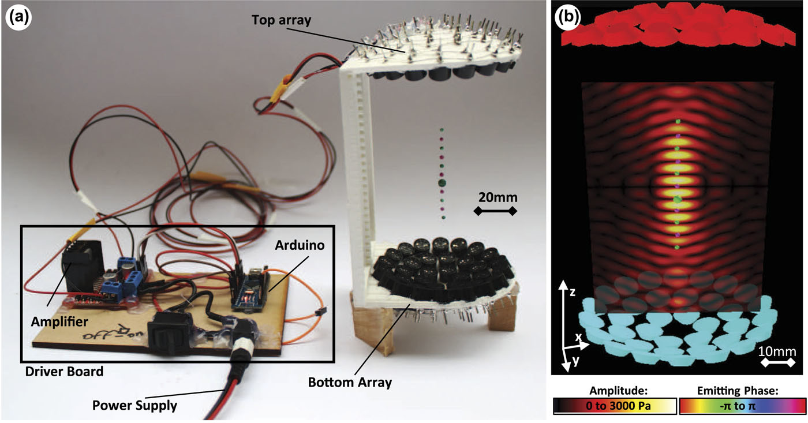
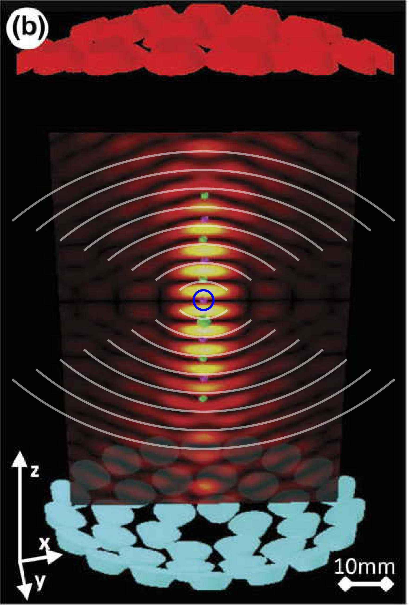

# Why am I getting too large a value for the speed of sound?

We have assumed that the levitator produces  **plane waves**, which are waves whose phase fronts are flat (planar). As illustrated in Fig. 1, this is not a particularly good assumption. Could the curvature of the wavefronts influence what we measure for the wavelength?

{: .mycap}
**Figure 1** --- Taken from https://aip.scitation.org/doi/10.1063/1.4989995.

# Gaussian beams

We might approximate the shape of the wavefronts following the well-established theory of [Gaussian beams](https://en.wikipedia.org/wiki/Gaussian_beam){: target="_new" }. To apply this theory to the levitator, we need to estimate the **Rayleigh range** $$z_R$$, which is the distance from the center of the pattern to the place along the symmetry axis at which the wavefront is most curved. Traditionally, we measure distance along the axis with the variable $$z$$, with the zero at the exact center of the pattern.  Gaussian beam theory also tells us that at $$z=z_R$$, the radius of curvature of the wavefront should be equal to $$2z$$.

  

{: .mycap}
**Figure 2** --- An estimate of the Rayleigh range made by eyeballing circular arcs with a radius of curvature of twice the distance, z from the center of the focused beam.

From the picture, it appears that the radius of curvature is closest to $$2z$$ at $$z \approx 4.5 \frac{\lambda_{\rm eff}}{2}$$, and thus $$z_R \approx 4.5\frac{\lambda_{\rm eff}}{2}$$. 

As discussed on the excellent [Wikipedia page on Gaussian beams](https://en.wikipedia.org/wiki/Gaussian_beam){: target="_new" }, along the $$z$$ axis the amplitude of the standing wave should be proportional to
\begin{equation}\label{eq:Gouy}
  y \propto \sin \bigg[\frac{2\pi z}{\lambda} - \text{arctan}(z/z_R) \bigg]
\end{equation}
If we can approximate the arctangent by its argument, we get the altered expression
\begin{equation}\label{eq:Gouy-approx}
    y \approx A \sin \bigg[ \bigg(\frac{2 \pi}{\lambda} - \frac{1}{z_R} \bigg) z \bigg]
    = A \sin \bigg( \frac{2 \pi z}{\lambda_{\rm eff}} \bigg)
\end{equation}
where
\begin{equation}
  \lambda_{\rm eff} = \frac{\lambda}{1-\frac{\lambda}{2 \pi z_R}}.
\end{equation}
From the image above it is most natural to find $$z_R$$ as a multiple of $$\lambda_{\rm eff}/2$$, so we introduce a parameter
\begin{equation}
  n = \frac{z_R}{\lambda_{\rm eff}/2} = \frac{2z_R}{\lambda_{\rm eff}}.
\end{equation}
Using this definition to substitute for $$z_R$$ in Eq. (3), and solving for $$\lambda$$, we get:
\begin{equation}
  \lambda = \frac{\lambda_{\rm eff}}{1+\frac{1}{\pi n}},
\end{equation}
the correction factor given in the lab manual for Week 3.  Based on visual analysis as discussed above, we find $$n = 4.5 \pm 0.25$$.  (The uncertainty is based on resolution error, since we can perform a visual comparison of an arc to a bright or dark fringe only every $$\frac{1}{2}\frac{\lambda_{\rm eff}}{2}$$.)

Let's say that you have determined from calibrated photographs of suspended beads that the (apparent) wavelength is $$\lambda_{\rm eff} \approx 9.2\text{ mm}$$. Using the value $$n = 4.5$$ discussed above, we would get a _true_ wavelength of
\begin{equation}
  \lambda = \lambda_{\rm eff} \bigg[1 + \frac{1}{n \pi} \bigg]^{-1} = 8.59\text{ mm}
\end{equation}
which yields a speed of sound of
\begin{equation}
  v_{\rm sound} = (8.59\text{ mm})(40\text{ kHz}) = 344\text{ m/s}
\end{equation}

<!-- To provide a rough sanity check on this analysis, if we use the uncorrected estimate of the wavelength from the expected value using $$v_{\rm sound} = 343 \text{ m/s}$$ and the drive frequency of 40 kHz, we get an estimated Rayleigh range of
\begin{equation}\label{eq:Rayleigh-range}
  z_R \approx \frac{9}{4} \times (343\text{ m/s}) (40\text{ kHz}) = 31\text{ mm}.
\end{equation}

Using the unshifted wavelength, $$\lambda = 8.575\text{ mm}$$, we get
\begin{equation}
  \lambda_{\rm eff} = 8.970\text{ mm}
\end{equation}
from which we would naively estimate the speed of sound to be
\begin{equation}
  v_{\rm naive} = (8.970\text{ mm})(40\text{ kHz}) = 359\text{ m/s}.
\end{equation}
x
-->

<!--I commented this out for now but am willing to switch back - You can use the above analysis to determine how to correct the value you measure for the wavelength to that of a plane wave from which you can easily determine the speed of sound. (Note: We are not providing you the final formula to use; you need to read and understand the above analysis to determine how to correct the value you measured for the wavelength under the assumption that you were looking at plane waves to a more honest estimate that accounts for the curvature of the wavefronts from which you may infer an accurate speed of sound.)-->
