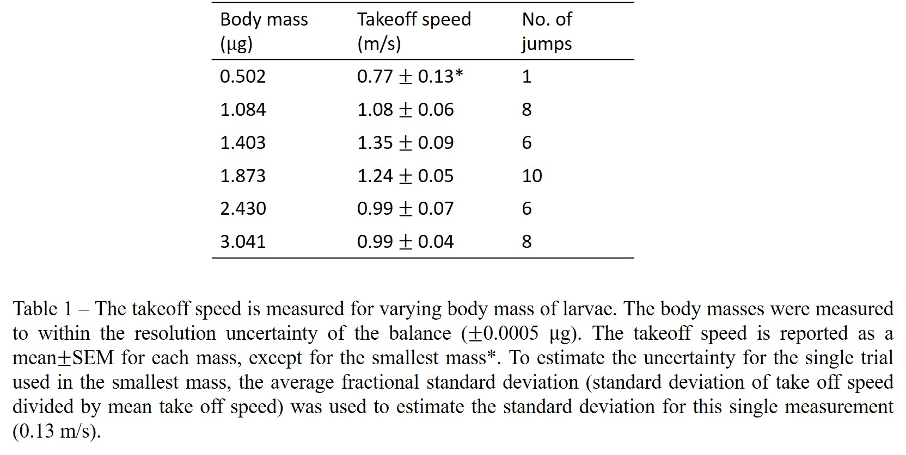
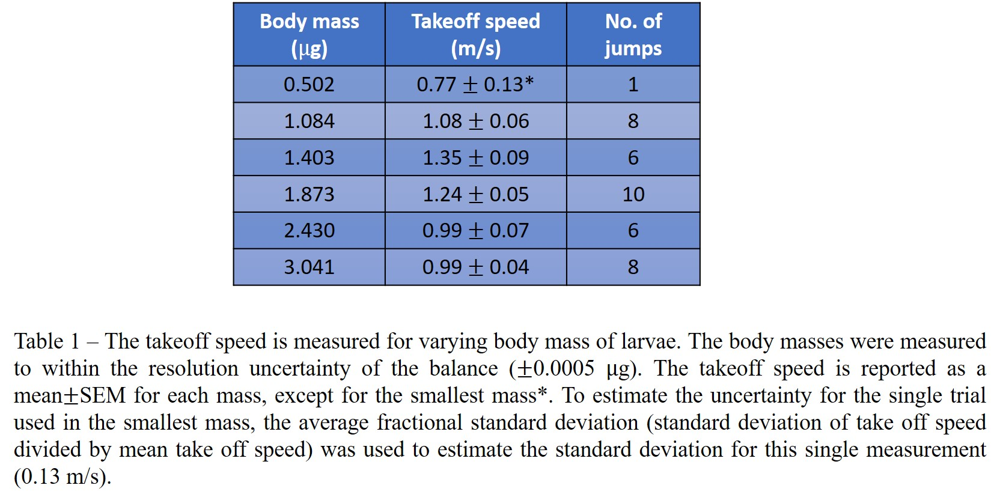

# A note on using tables

While most of the time we want to display information in figures that contain images and plots, sometimes a table can be helpful. You might want to add a table if: 

1) There is a lot of qualitative information, or the relationship between variables is not important for what you want your reader to take away. 

**AND**

2) The information you are presenting does not appear elsewhere. **Do not include a table of data that you also plot!** 

There are some design principles to consider when creating tables. The principles of "salience" and "simplicity" we applied to making plots also apply to creating tables. [This guide to formatting tables](https://people.inf.ethz.ch/markusp/teaching/guides/guide-tables.pdf#page=6){:target="_blank"} provides a nice overview, which we briefly summarize here:

+ Avoid vertical lines
+ Avoid “boxing up” cells with many horizontal lines
    + usually 3 horizontal lines are enough: above the table, below the table, and after the heading row
+ Avoid double horizontal lines
+ Add enough space between rows so items don't look cluttered
+ By default, align each column to its left hand side

## Good Example

## Bad "default MS Office" Example

