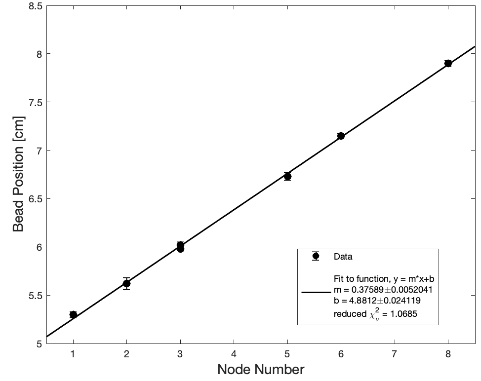

# Week 3

1. [Why am I getting too large a value for the speed of sound?](#why-am-i-getting-too-large-a-value-for-the-speed-of-sound)
1. [Background: Data Analysis](#background-reading-for-data-analysis)
2. [Lab Instructions for Week 3](#lab-instructions-for-week-3)
3. [What you need to leave lab with this week](#what-you-need-to-leave-lab-with-this-week)
3. [Checkpoint #3](#checkpoint-3)

## Why Am I Getting Too Large a Value for the Speed of Sound?

Over the past two weeks you performed careful measurements to determine the speed of sound. In week 1 you surveyed a range of potential systematic errors and hopefully determined which ones appeared to be the most significant. In week 2 we directed you to focus your attention on parallax - a very significant potential source of systematic error in this experiment. After such a careful investigation it must have been satisfying to get a result that agreed to the expected value to within experimental error...... unless of course you didn't. 

Throughout this course we have we have asked you to pay careful attention to uncertainties. Here are some sample results reported by students last week:

| Speed of Sound          | Uncertainty  | 
| ----------------------- | ------------ | 
| 360.5 m/s               | 1.2 m/s      | 
| 369.1 m/s               | 1.1 m/s      |
| 359.1 m/s               | 1.7 m/s      |

If you have appropriately controlled for systematic errors and accounted for random errors, your results should differ from the mean by approximately their uncertainty. But perhaps you still feel the above results are "close enough" to the expected value (343 m/s at $$20^{o}$$C). 

The above results differ from the expected value for the speed of sound by on the order 10x their uncertainty! To get a sense of how unlikely that is, for a normal distribution a $$5 \sigma$$ event, (i.e. 5 standard deviations from the mean) has a probability of 1 in $$\approx$$3.5 million, a $$6 \sigma$$ event has a probability of 1 in $$\approx$$0.5 billion. Clearly we should give some more thought to explaining the discrepancy between these results and the expected value.

When experimental results don't agree with the expected value it is a good idea to:
1. Check to make sure you trust your experimental results. Were you careful to minimize potential sources of systematic error and to appropriately randomize potential sources of uncertainty by resetting the experiment?
2. Check to make sure you trust the "expected value". For example, 343 m/s is the accepted value of the speed of sound under a specific set of conditions. Do those match the conditions in the lab? 343 m/s is the appropriate speed at $$20^{o}$$C. While the speed of sound depends on temperature, our laboratory conditions were close enough to $$20^{\circ}$$ C that we aren't going to be able to explain the discrepancy with temperature. You might also consider pressure, but the dependence of the speed of sound on pressure is extremely weak.
3. When all else fails it can be a good idea to check if you are confident in your theory. 

The theory we have relied upon assumes the levitator produces plane waves. However, if you took the time to investigate the sound waves with dry ice last week you may have noticed significant discrepancies from plane wave behavior. We can in fact account for this! You will not be responsible for the details of the more complete theory but are encouraged to [read a summary here](gouy).

Bottom line:

You can correct for the 3D structure of the standing waves by applying the following correction to get the actual wavelength ($$\lambda$$) from  your measured value, $$\lambda_{\rm eff}$$:

\begin{equation}
  \lambda = \frac{\lambda_{\rm eff}}{1+\frac{1}{\pi n}}
\end{equation}

For our system the instructors have determined that $$n=4.5 \pm 0.25$$. ([see previously mentioned supplemental materials](gouy)). We will talk more in class about how to incorporate the uncertainty in $$n$$ into your final result for the speed of sound. 

### Background Reading for Data Analysis
One of the most important ideas we want you to take from Module 2 is to think of a data set as a whole, not as individual points. 

In the analysis you completed in weeks 1 and 2, you measured the spacing between a single, fixed number of nodes. But the “node number” provides us with an independent variable that we can control, so by measuring the position of multiple nodes, we can create a plot of position versus node number. Plotting the data and looking at the data set as a whole gives us confidence in our ability to determine the speed of sound, since it allows us to fit the data to the theoretical prediction in a more robust way. You do not need beads in every node to use this method, but you do need to use sound judgment and consistency with the theory to appropriately assign the node numbers to your levitated beads. 

At the end of Module 1 we introduced MATLAB and used it to generate a horizontal line of best fit. In this module we will continue to use MATLAB for data analysis. 

How do we extract a slope from our measured data? You have previously fit a horizontal line, but now you will fit a line with a nonzero slope. To understand this fitting process, you now need to carefully read the [curve fitting guide](curve-fitting){:target="_blank"}. In it you will find a MATLAB script that includes a linear fit with both an intercept and a slope.

To ensure you are prepared to analyze your data, please make use of the following figure to answer the subsequent mini-question.

{:target="_blank"}
----

#### Miniquestion 1: Estimating the speed of sound from a sample plot
[*Click here to open in a new tab*](https://docs.google.com/forms/d/e/1FAIpQLSdyYDI3QEI4FDsfW4d0M4krPmhwPUsgcYBsDG48WcajfMYhgg/viewform?usp=sf_link){:target="_blank"}

<iframe src="https://docs.google.com/forms/d/e/1FAIpQLSdyYDI3QEI4FDsfW4d0M4krPmhwPUsgcYBsDG48WcajfMYhgg/viewform?embedded=true" width="640" height="300" frameborder="0" marginheight="0" marginwidth="0">Loading…
</iframe>

-----

## Lab Instructions for Week 3

### Collection of Preliminary Data

Make sure you are using the same levitator as last week (you should have made note of the levitator number).

Last week should have convinced you that parallax is a significant source of uncertainty in this experiment. You also should have come up with a strategy to minimize its effect and then estimated the magnitude of its effect through multiple trials in which you randomized the position of the ruler as well as the relative position of the camera and levitator.

This week we are going to collect a data set that will allow us to obtain a more accurate estimate of the speed of sound by fitting a line representing the bead position as a function of node number.

To do this you will need a reliable mark on your levitator that you can use as a consistent origin to compare data from multiple photos. This should not be a bead (can you think why? If unsure talk to your section instructor) and also should be attached to the levitator (if you instead used for example a point on the table there is a risk it might move between images, e.g. if the levitator moved). This time you want to position as many beads in the levitator as you can. Aim for at least 5 but hopefully you can get more than that (remember that you will be graded on quality of data). **You may find it easier to trap more beads in the levitator if you rotate the levitator by 90° and trap the beads in a vertical column.** This is worth trying! It is okay if you skip some nodes as long as you keep track of where they are so you can assign each bead to a node number.

Once you have two good images with at least 5 beads (make sure to reposition the ruler, beads, camera or levitator and anything else you think might be important between images) you should perform an analysis of the first two photos --- doing a preliminary analysis along the way can save you time by ensuring there aren't any major flaws in your data collection before collecting a full set of data. You may want to have one lab partner extract data from each of the two photos in parallel, but make sure you agree on the origin you will use.

### Analysis of Preliminary Data

Your goal is to use five distinct photos to estimate the position of each node (based on the position of beads). To prepare for this you will want to set up a sheet in your assigned spreadsheet for this module. At the top you will want to indicate that you are measuring the position of beads relative to the origin (in mm). You will want to assign a column for each node #. Note that while the assignment of which node is "node 1" is arbitrary, it needs to be at a consistent location between photos. That means that if you assign "node 1" to be the left-most bead in your first photo and then have a later photo in which you were able to levitate more beads further to the left, you will have to assign these "node 0", "node -1", etc., extending leftward. This is fine. The $$y$$-intercept of your plot of bead position vs. node number is arbitrary in this case; we are only interested in the slope.

To get a good set of data you will need to adjust for/minimize rotation in your image --- make sure you measure the distance from your origin to the beads along the direction parallel to the axis of the column/row of beads. 

Prepare a plot of bead position vs. node number with the curve fitting script provided in the section [Background: Data Analysis](#background-reading-for-data-analysis). Since you are only analyzing two images you will have at most two data points for each node. Statistical analysis such as computing the SEM is not meaningful with only two data points. However, it is still helpful to estimate the uncertainty as part of our preliminary analysis so that we can gauge whether our preliminary results appear reasonable. With only two data points, the best we can do is estimate our uncertainty to be the spread between the data points.

**What if you only have a single data point for some nodes?** 
Unfortunately you will not be able to use that data this week. You have no way to estimate the uncertainty in those data points and our weighted fit will not be able to cope with data points for which you cannot appropriately account for the uncertainty. But keep track of the relevant data - hopefully, you will be able to use it next week when you analyze the remaining photos. 

----

#### Mini-question 2: Estimating the uncertainty from 2 data points
[*Click here to open in a new tab*](https://forms.gle/MYkieS2qvmeJzMrv8){:target="_blank"}

<iframe src="https://docs.google.com/forms/d/e/1FAIpQLScjcyLeUy89qqC5gO9NOrWYJyqoBE2POMnF4BxFvDqsy6i-iQ/viewform?embedded=true" width="640" height="300" frameborder="0" marginheight="0" marginwidth="0">Loading…
</iframe>

-----

Once you've prepared your plot you should take a good look to see if you are satisfied with the plot before moving on. Here are some things you might check:

+ Are there any major apparent discontinuities or discrepancies from linearity? One of the benefits to plotting the data is that if you missed a node you can correct for it. If there is a discontinuity in your plot take a look at your image and data. Does it look like there is a node with a bead missing? If so go ahead and shift the data - after doing so are the results linear? If this is an issue you are having this would be a good moment to touch base with your instructor. 

+ If you were able to trap a large number of beads you might expect variations far from the center of the levitator, whether due to irregularities in the standing wave pattern or due to distortion of the image. Do you see any sign of this in your results? If you have reason to suspect that your edge data points are deviating from your theory (i.e. they don't match the linear trend well the rest of the data does) it is reasonable to not include them in your analysis. If you see this this would be another good moment to touch base with your instructor.

+ The slope should represent the separation between nodes. Does the result agree approximately with what you would expect just looking at the beads in the levitator? (If not you should check for a mistake in your analysis)

+ Is your $$\chi^2$$ reasonable? Keep in mind that so far you've only analyzed two images and your uncertainties are just a rough approximation. 

+ If you use the slope to estimate the speed of sound and apply the correction at the beginning of this week's instructions, do you get a reasonable result?

### Collection of Complete Data Set

Once you are satisfied with your results from the analysis of 2 images you need to collect a complete data set (5 distinct photos, i.e. 3 more than the 2 you already collected) so that you can estimate the uncertainty.

Like last week you should reposition the ruler as well as the position of the levitator relative to the camera in between each measurement, but this time **you will also need to levitate a fresh set of beads for each photo.**

**You are not required to analyze all of your data for this week's checkpoint. But you are required to take at least 5 different pictures that you will use for your data analysis and to analyze at least two of them.**

As for Module 1, you will need an uncluttered image or images of your experimental setup (with a scale bar) for your deliverable. In this case it is likely that you will find the images you've already taken will meet your needs. But just in case, before leaving lab take a moment to think if you need to take any additional photos to showcase your experimental procedure in the deliverable.

Make sure to note which levitator you are using (it should be the same one that you used last week).

If you have extra time you should begin analyzing your other three photos.

## What you need to leave lab with this week

+ 5 images of levitated beads for which you both reset the ruler and the beads. Each image needs to include at least 5 beads, more would be preferable.

+ A linear regression fit to data extracted from the combined data of 2 of the five images

# Checkpoint 3

Checkpoint 3 will take place in two parts:

**Part 1: Practice calculation**
*You may resubmit Module 2, checkpoint 3, Part 1 as many times as you like until you get the correct answer (it is auto-graded and will give you an immediate response). For this part **only** it is also okay to "save" your responses to the individual questions.*

 You should do part 1 before part 2. However, we do not recommend completing part 1 before you come to class as we will discuss how to appropriately combine two separate sources of uncertainty in class.

**Part 2: Post-lab analysis**
For part 2 our usual rules apply:
**Reminder:** Please prepare your assignment in a separate document, enter all entries in a single sitting without using the "save" button and then make use of the "submit" button to submit your work. You may not resubmit your work once it has been submitted (and saving in Gradescope is equivalent to submitting).

+ A screenshot of your organized spreadsheet which is set-up for analysis of 5 images although you are only expected to have analyzed two for this checkpoint.

+ The 5 photos you will use for your data analysis

+ A plot of bead position vs. node number, prepared in MATLAB, based on the results you extracted from a two image. The individual data points should include uncertainties estimated from the spread between the two data points for each node. Data from nodes for which you only have a single measured value should not be included. Please display the fit parameters on the plot (the provided script will do this for you).

+ From your analysis, you should have a slope, $$m \pm \delta m$$, of a plot of bead position vs. node number. From this you will determine the effective wavelength, $$\lambda_{\rm eff} \pm \delta\lambda_{\rm eff}$$. You will calculate the wavelength $$\lambda \pm \delta\lambda$$ from the effective wavelength, making use of the correction to account for the 3D structure of the standing waves as discussed at the start of this week's instructions. Your calculation will make use of the parameter $$n$$ and its uncertainty, $$\delta n$$ which was provided above. In terms of these parameters (without plugging in numbers) you will be asked to provide a calculation of your formula for the propogated uncertainty in wavelength, $$\delta\lambda$$ due to the uncertainties $$\delta m$$ and $$\delta n$$.

+ A calculation of the speed of sound with uncertainty based on your line of best fit to the plot. As part of your calculation of the speed of sound you are expected to have applied the correction to the measured wavelength (as determined from your plotted data) to account for the 3D structure of the standing waves as discussed at the beginning of this week's instructions.

+ And to double-check, make sure you have finished all of this week’s mini-questions by [checking here](mini-questions#week-3){:target="_blank"}.

