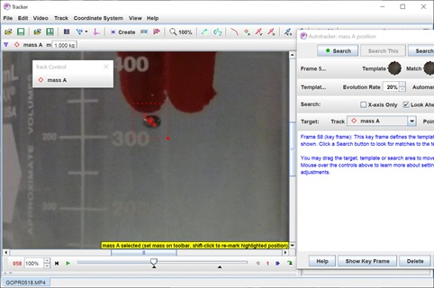

# Week 1: Exploratory Phase

--------------
1. [Background Reading](#background-reading)
2. [The Experiment](#the-experiment)
3. [Week 1 To-Do Summary](#week-1-to-do-summary)
4. [Step-by-Step Tracker Instructions](#step-by-step-tracker-instructions)
5. [Checkpoint: Preliminary Viscosity Value](#checkpoint-1)

--------------

We begin our investigation of viscosity -- denoted with the Greek letter $$\eta$$ (eta), pronounced "EH-tah" -- by doing an initial exploration. Our goal is to learn how to use the available data to find a value of the viscosity of our glycerin solution. In the Exploratory Phase it can be especially important to take detailed notes. Organizing a digital lab notebook and data spreadsheet can be tricky, so for Week 1 we are providing a [template for you to follow along with that we've assigned from Google Classroom](https://classroom.google.com/u/0/w/MjUxNTgyMzY1MDM5/tc/MjUxNTgyMzY1MDQ2){:target="_blank"}. 

**Make sure you have this spreadsheet and your Module 2 Lab Notebook handy as you go through the content on this Week 1 page. As a reminder from module 1: Please note that we require you to use the provided spreadsheet/lab notebook. The shared spreadsheet will make it easier for us to troubleshoot if any issues come up**

## Background Reading

Often the first step is to do some background reading and theoretical analysis.  Consider a metal sphere of mass $$m$$ and radius $$r$$, falling vertically through a liquid of density $$\rho$$ and viscosity $$\eta$$.  The sphere’s position as a function of time is determined by its initial velocity and by the several forces that act on it.  The sphere experiences the force of gravity, directed downward with magnitude $$F_g=mg$$.  At the latitude and elevation of Claremont, California, $$g=9.7959 \pm 0.0001 \ \mathrm{m}/\mathrm{s}^2$$.  The sphere also experiences an upward buoyant force; you can think of it as a kind of normal force exerted by the fluid, though since the fluid is not rigid, the force is not large enough to keep dense objects from falling through it.  Archimedes discovered that the magnitude of the buoyant force on an object is equal to the weight of the fluid displaced by the object:  $$F_b=(\mathrm{Sphere \, volume})\times(\mathrm{fraction \, submerged})\times(\mathrm{density \, of \, fluid})\times g$$, or for us, since the entire sphere is submerged throughout its trajectory, $$F_b=\frac{4}{3}\pi r^3 \rho g$$.

Once the sphere is in motion at speed $$v$$, it also experiences a viscous drag force directed opposite its motion, with magnitude $$F_d=6\pi r\eta v$$.  You may recall from Physics 24 that a viscous drag force comes from the reluctance of “layers” of fluid to separate from each other so an object can move through them, and the viscous drag force is linearly proportional to the object’s speed and linear size.  The specific numerical factor of $$6\pi$$ applies to a spherical object.  The object also experiences an inertial drag force, which comes not from an interaction between fluid molecules but just from the fact that an object moving through the fluid must push individual fluid molecules ahead of it as it moves.  In our experiment, we hope that the inertial drag force is negligibly small compared to the viscous drag.  At the beginning of Module 2, you should assume that this is the case, and neglect the inertial drag force entirely.  Later in the module you will be asked to check this assumption.

Assuming that only gravity, buoyant force, and viscous drag are significant, **set up Newton’s second law for a falling sphere.**  Remember to do this in your lab notebook!  When the sphere is falling slowly, what direction will the net force and acceleration point in?  Will the sphere speed up or slow down?  If the sphere is falling very fast (e.g., if it is thrown down with a large initial speed), what direction will the net force and acceleration point in?  Will the sphere speed up or slow down?  Find a formula for the terminal speed $$v_T$$ that the sphere should approach, regardless of its initial velocity, after it has been falling for a long time.  (The terminal *velocity* $$\vec{v}_T$$ has magnitude $$v_T$$ and points downward.)  Remember that an object’s terminal velocity is the velocity at which it experiences zero net force and therefore at which its acceleration becomes zero.

--------------------------------------------

#### Summary of Forces

Force | Functional Form
----- | --------------
Gravity | $$F_g = mg$$
Buoyancy | $$F_b=\frac{4}{3}\pi r^3 \rho g$$
Viscous Drag | $$F_d=6\pi r\eta v$$

#### Summary of Physical Variables

Symbol | Variable Description
----- | --------------
$$r$$ | radius of the sphere
$$m$$ | mass of the sphere
$$\rho$$ | density of the liquid
$$\eta$$ | viscosity of the liquid

------------------------

#### Miniquestion 1: Terminal Speed Under Viscous Drag Force
[*Click here to open in a new tab*](https://docs.google.com/forms/d/e/1FAIpQLSdWtojxTUSbOQ8q3gGGaOYhMket8eiRAB5L-Jyw6q3cTwR72Q/viewform){:target="_blank"}

<iframe src="https://docs.google.com/forms/d/e/1FAIpQLSdWtojxTUSbOQ8q3gGGaOYhMket8eiRAB5L-Jyw6q3cTwR72Q/viewform?embedded=true" width="640" height="300" frameborder="0" marginheight="0" marginwidth="0">Loading…
</iframe>

-------------------------------

## The Experiment

You will use videos of spheres falling through a glycerin solution to find the terminal speed of a sphere and use it to calculate the viscosity of the liquid.  Use terminal speed because, as you have seen above, it is insensitive to variations in the initial conditions of each sphere drop, which are hard to control precisely.  One further experimental note:  **it is important to use data from situations where the sphere is far from walls or floor of container** – otherwise not just the viscosity of the fluid is involved, but the fluid’s adhesion to the solid surfaces as well.  For this reason, we have used a fairly wide 500-mL beaker in the videos, and have attempted to drop the spheres at the center of the beaker in each trial.

#### Miniquestion 2: What Else Goes into Finding Terminal Speed?
[*Click here to open in a new tab*](https://docs.google.com/forms/d/e/1FAIpQLSexx5OysAF5UuAoDAvcDROzKvL3F4BWM5nqgIZgcEqLnnvdPg/viewform){:target="_blank"}

<iframe src="https://docs.google.com/forms/d/e/1FAIpQLSexx5OysAF5UuAoDAvcDROzKvL3F4BWM5nqgIZgcEqLnnvdPg/viewform?embedded=true" width="640" height="300" frameborder="0" marginheight="0" marginwidth="0">Loading…
</iframe>

-----------------------

#### Miniquestion 3: What Else Goes into Finding Viscosity?
[*Click here to open in a new tab*](https://docs.google.com/forms/d/e/1FAIpQLSdKiHbgik4x-4SbWPJXXVLAhDbKKsZaUJJCS5JlRIAKbTUjJA/viewform){:target="_blank"}

<iframe src="https://docs.google.com/forms/d/e/1FAIpQLSdKiHbgik4x-4SbWPJXXVLAhDbKKsZaUJJCS5JlRIAKbTUjJA/viewform?embedded=true" width="640" height="300" frameborder="0" marginheight="0" marginwidth="0">Loading…
</iframe>

-----------------------

Videos were taken of several spheres dropping through the glycerin solution as described above.  The camera and beaker were moved slightly between videos.  Care was taken when setting up for each video not to tilt the camera vertically up or down.  (Think about why this might be important, and how you could check that we accomplished it.)  After each sphere reached the bottom of the cylinder, a ruler was inserted into the beaker to help you determine an actual distance scale for measuring the falling sphere’s trajectory.  In each video, the ruler was placed, to the best of our ability, directly at and above the final location of the sphere, so that the millimeter markings on the ruler occupy the same locations in physical space (and in the video frame) as the trajectory of the sphere.  The small marks on the ruler are millimeters; the numbers next to the large marks are centimeters.

We used spheres of four different nominal diameters.  For each nominal diameter, we took videos of five different spheres dropping through the liquid.  All videos were taken with a GoPro Hero 5 Black, at 60 frames per second and with the lens set to “linear” imaging.

You can download [a single zip file of all the videos for this module.](https://drive.google.com/file/d/1mq6X3mSFBtJesws0HiknjeBh-Jb7IdTo/view?usp=sharing){:target="_blank"} This zip file is quite large (1.7 Gb). If you'd prefer to selectively download the video files for this week (for the 3.5 mm diameter sphere), you can [download the individual video files here instead](https://drive.google.com/drive/folders/1TUSCJrpfsHUwvsdA5mZCNaW4uW_KCt8x?usp=sharing){:target="_blank"}.

The spheres themselves were massed on a digital scale with resolution 0.0001 g.  Ten different spheres of the same nominal diameter were each massed once.  We will come back to the issue of mass variation in Week 3, but for now the table below lists the average measured mass for each nominal sphere size.

The sphere diameters were measured repeatedly with digital calipers (resolution 0.01 mm).  For almost all sphere sizes, measurements of ten spheres gave identical results; for one sphere size, results were evenly split between two values different by 0.01 mm, so the table below assigns a diameter value halfway between the two.

#### Sphere Sizes and Masses

| Nominal Sphere Diameter | Average Mass | Measured Diameter |
| ----------------------- | ------------ | ----------------- |
| 1.8 mm                  | 0.0245 g     | 1.80 mm           |
| 2.5 mm                  | 0.0655 g     | 2.495 mm          |
| **3.5 mm** (Week 1)                 | **0.1772 g**     | **3.47 mm**           |
| 6.0 mm                  | 0.8997 g     | 5.99 mm           |

The density of the glycerin solution was measured by finding the mass difference between an empty 50-mL graduated cylinder and the same cylinder with 50mL of glycerin solution in it.  This measurement was repeated several times.  The density measured in this way was $$1.241 \pm 0.003 \ \mathrm{g}/\mathrm{cm}^3$$.

## Week 1 To-Do Summary

In Week 1 you will analyze data from five spheres of nominal diameter 3.5 mm (video files GOPR0663.mp4 through GOPR0670.mp4, note that some video file numbers were skipped along the way).  Your goal for Week 1 is to learn to extract position vs. time from these video files and use your results to find first-pass estimates for the viscosity of the liquid and the uncertainty in the viscosity. 

To analyze the videos, first install Tracker from [physlets.org/tracker](https://physlets.org/tracker){:target="_blank"}.  This program allows you to step through a video frame by frame.  It also has features for tracking and plotting the position of an object as a function of time, using a distance scale that you calibrate and a time scale that Tracker automatically sets from the frame-rate info in the video file.  Also download to your computer each video (.mp4) file from the table above that you want to analyze.

Use Tracker (detailed instructions below) to generate and plot vertical position vs. time information for a sphere as it falls.  Use the shape of the position vs. time curve to verify that the sphere approaches terminal velocity, and then use the position vs. time data to calculate the terminal speed.  **Do NOT use the velocities calculated by Tracker**, since these are calculated from position vs. time data in a way that is quite sensitive to noise, especially when the sphere position cannot be marked in every frame.  (See [https://physlets.org/tracker/help/frameset.html](https://physlets.org/tracker/help/frameset.html){:target="_blank"} for details on Tracker’s velocity calculations if you are interested in following up on this.)  Use only the position vs. time data from Tracker.  

Analyze several different videos to determine an average terminal speed for this particular size and mass of sphere, and to determine a random error in your terminal speed value.  The random error will be determined by calculating the standard error of the mean (SEM) from your several trials.  Then use your terminal speed value and other known quantities to calculate the viscosity of the glycerin solution, and also calculate the uncertainty in the viscosity based on the random error in terminal speed.  The viscosity is quite sensitive to glycerin/water ratio, temperature and humidity (as the solution can absorb additional water from the air), so gain confidence in your results based on the measurements and analysis, rather than by looking for detailed agreement with a “glycerin viscosity” found even in a reliable reference.  However, to help you quickly check your work, note that a good order-of-magnitude estimate for the viscosity is approximately $$1 ~ \mathrm{Pa}\cdot\mathrm{s}$$ or $$1 ~ \frac{\mathrm{kg}}{\mathrm{m}\cdot\mathrm{s}}$$.

In Week 1, we are presuming that every other quantity that goes into the viscosity calculation is an infinitely precise constant, so we focus only on the uncertainty that comes from the random error in terminal speed.  Still, in calculating the uncertainty in viscosity due to random error in terminal speed, you will need to propagate error through a formula.  You might want to review Prof. Gerbode's video tutorial on how to do such propagations:
[Click on the link to get to the video](https://drive.google.com/file/d/1ilJNsVSgB_asmDdfjQwoyRdhedsSjaWO/view?usp=sharing){:target="_blank"}

--------------------------------------------------------

#### Miniquestion 4: Propagating Error from Terminal Speed to Viscosity
[*Click here to open in a new tab*](https://docs.google.com/forms/d/e/1FAIpQLSfN_9bu9VkA7aEr6lyVUvddwqyQ9i76D7L3HRkSNcxkbsTRkQ/viewform){:target="_blank"}

<iframe src="https://docs.google.com/forms/d/e/1FAIpQLSfN_9bu9VkA7aEr6lyVUvddwqyQ9i76D7L3HRkSNcxkbsTRkQ/viewform?embedded=true" width="640" height="300" frameborder="0" marginheight="0" marginwidth="0">Loading…
</iframe>

--------------------

**A few common "gotchas" to look out for in your calculations:**

1. make sure you are converting diameter to radius when needed
2. check that you are converting masses to kilograms throughout your calculation, including where a unit of mass appears in a density
3. check that you are converting distances to meters throughout your calculation, including where a unit of distance appears in a density or a velocity.

---------------------------------

## Step-By-Step Tracker Instructions

Learn how to use Tracker to extract the terminal velocity from a falling sphere by
[following along with this step-by-step video (click to open in new tab)](https://drive.google.com/file/d/1PWLR3sS8bN848P969W5R_YPJW0h_p1CK/view?usp=sharing){:target="_blank"}

<iframe src="https://drive.google.com/file/d/1PWLR3sS8bN848P969W5R_YPJW0h_p1CK/preview" width="640" height="480">
</iframe>

We recommend opening Tracker and working alongside the video, or you can follow the detailed instructions below:

Open Tracker.  In the “File” menu, select “Open File” and choose the first video you want to analyze.  It will take a few seconds to load a several-second-long video; you’ll see a pop-up window with a progress bar.  Tracker is fairly user friendly, so if you enjoy messing around on your own you can ignore all of these instructions and figure out the features as you go along.

**Changing coordinate axes:**

Tracker automatically uses a horizontal x axis (increasing to the right) and a vertical y axis (increasing upward).  If horizontal and vertical on the video frame are well aligned with true horizontal and vertical, and you do not care about the location of the origin, you may not need these steps.

To define the coordinate system, click on the purple coordinate axes icon, which you will find in the top toolbar slightly to the left of “Create.”  Purple axes appear; if you can’t see them, try zooming out your view of the video until the axes appear.  You can click on the origin to drag it; to avoid dealing with both positive and negative positions, you may want to set the origin either above or below all the locations the sphere will pass through.  If you would like the positive direction to be down, you may want to go to “angle from horizontal” and enter 180; this will make the positive y direction be down and will also make the positive x direction be to the left.  (The positive x direction should be largely irrelevant since we won’t be quantitatively analyzing that motion.)
 
If the true vertical direction is not well aligned with the video frame, you can adjust the angle of the x and y axes so that the y axis matches true vertical.

**Calibrating distance:**

In the latter portion of each video, after the sphere has landed on the floor of the cylinder, you will see that a ruler has been inserted into the beaker to help you determine an actual distance scale for measuring the falling sphere’s trajectory.  In each video, the ruler is placed, to the best of our ability, directly at and above the final location of the sphere, so that the millimeter markings on the ruler occupy the same locations in physical space (and in the video frame) as the trajectory of the sphere.   We have tilted the ruler side to side slightly in most videos, so that you can pick a frame in which the ruler is nicely vertical.  Use the ruler portion of each video to establish a distance calibration, via the steps below.  You should also verify that the distance scale is constant over the height of the liquid. 

In the top toolbar, click “Create,” then “Calibration Tools,” and then “calibration tape.”  A yellow instruction bar at the lower right will tell you to hold down the **Shift** key and then **click** where you want the first end of your calibration tape to be; then release the shift key.  After you have created the first end, you can click and drag it to fine-tune its position.  Still following the yellow instruction bar, hold down the **shift** key and **click** somewhere else to place the other end of your calibration tape.  You can now click and drag it to adjust it further.

A length should appear next to the calibration tape and also in the calibration tape info just above the video image.  Click on either place the length appears, to type in the actual or “world length” you want to assign to this tape.  This sets the conversion Tracker will use from pixels to actual distance.  Note:  Use a space between numbers and units, i.e., “60.0 mm” rather than “60.0mm” to get Tracker to recognize your units.  If you enter the distance in units other than meters, Tracker will ask you to confirm that you want to change the length unit.

The calibration tape will now appear overlaid on all frames of this video.  If you would prefer to have it out of the way for the rest of your work, click somewhere in the middle of the tape and simply drag it to the side, away from the region of interest.

Note:  If you accidentally click and drag one end of the tape after you have done the calibration, Tracker will change the “world length” of the tape to match the new location of the end; your accidental drag will not mess up the pixels-to-distance calibration you already established.  This is one advantage of using “calibration tape” instead of “calibration stick.”

**Tracking the sphere:**

Select a portion of the video to analyze.  You can do this by dragging the two black arrows beneath the video progress bar.  You will want to start your analysis when the sphere is clearly visible and freely falling. Near the bottom of the cylinder, the sphere falls through one or more stripes of altered background or lighting.  Autotracking is not likely to work across these transitions, so your work will be easier if you end your analysis just before the sphere crosses the first change in lighting.

After setting the start and end frames, use the large marker on top of the video progress bar to return to the start of your selection.  (If you drag the large marker too far left, it will just snap to your start frame.)

In the top menu list, select “Track,” then “New,” and then “Point Mass.”  A small “Track Control” window will appear, listing “mass A.”  Go back to the top menu and select “Track,” then “mass A,” then “Autotracker...”  Now a third “Autotracker:  mass A position” window will appear.

You will now take steps to tell the software what the sphere looks like and to help it track the sphere’s position in the frames you have selected.  We suggest you zoom in to get a clear and detailed view of the sphere in your first frame.  Now following the instructions in the Autotracker window, hold down **Shift** and **Control** and **click** on the sphere in the video frame.  After you have done that, you should see something like this:

    
If you do not see the small hollow circle and solid square to its lower right, Tracker might have advanced you to the next video frame; if so, the back arrow in the bottom right-hand corner will be active (dark blue) instead of grayed out, and you can use this back arrow to step back to the key frame.

Once again, instructions are available in the Autotracker window. The hollow circle defines the template image that Tracker will search for; click and drag on the solid square attached to it to change its size and shape.  Click and drag on the circle itself to move it; we suggest defining a template image something like this:
 

Finally, click on the small cross marker in the middle of the circle and drag it to the middle of the sphere.  This is the actual marker whose position will be recorded in each frame.

The larger dotted square shows the box within which Tracker should search for a match to the template image.  In our experience there is little need to adjust this; it will move automatically based on the locations of the matches in sequential frames.  In the Autotracker window, “Evolution Rate” and “Automark” are parameters for the tracking algorithm that we have also found no need to adjust.  Evolution Rate specifies a rate at which the software should expect the image to change from frame to frame (e.g. light reflecting differently off the sphere), and “Automark” sets a threshold for the software to automatically accept a match.  “Search” should have the “X-axis only” box unchecked and the “Look Ahead” box checked, which again are the default settings.

You are ready now to go to the Autotracker window and hit “Search.”  The software will step through each frame; the video window will show the current positions of the search box, the best match to the template, and the position marker.  It’s a good idea to watch these to make sure they look reasonable.  When the sphere image is significantly obscured, the autotracking will stop and wait for you to Accept, Skip, or manually mark the frame.  If the region shown is a good match to the template – both in actually being the sphere and in being properly centered on the sphere – you can Accept:
 

 
If the tentative match is significantly incorrect, we suggest you Skip, or shift-click to manually mark the correct sphere location.  If you Accept a match that is improperly centered, the software will update the template based on it and you will find that the position marker is poorly centered in the sphere in all future frames.

After skipping one or more frames, you will find a frame you are willing to Accept, or perhaps the software itself will come to a frame whose match score is high enough to be automatically accepted.  At this point you will see a warning window:

 
You must click “Close” in this window to proceed with the tracking process.  You can choose to mark “Don’t show this again.”  Recall that we are, indeed, not planning to use velocities or accelerations calculated by this program.

After all your selected frames have been analyzed, the video will halt on the final frame.  

If incorrect matches are made, either automatically or manually, Tracker does allow you go back to individual frames / data points after the fact and delete single points, or delete all points after a certain one.

**Analyzing position vs. time to get the terminal velocity:**

Throughout the tracking process, a graph of position vs. time and a table of data have been updating to the right of the video.  To view vertical position as a function of time, click on the vertical axis label and select “y:  position y-component” from the menu that appears.  Your Tracker window should now look something like this:

 
Take a look at your graph of $$y$$ vs. $$t$$ and notice that it is not linear throughout the entire video! Initially the ball velocity increases until it reaches terminal velocity. Then, near the end of its drop, the velocity changes again due to fluid flow interactions between the ball and the bottom surface of the beaker. However, for each video you will analyze, **there will be a central part of the $$y$$ vs. $$t$$ plot over which the velocity is fairly constant. This should be most of the plot -- you just need to avoid the beginning and the end bits where it is clearly not just a straight line.** Identify a starting time $$t_i$$ at the beginning of the linear region and an ending time $$t_f$$ at the end of the linear region, then use the data table to find a terminal velocity via $$v_T=\frac{y_f-y_i}{t_f-t_i}$$. Hooray, you have just found your terminal velocity from your first video!

**File management:**

To save everything you have done to the current video (including video frames, calibration, position vs. time information from tracking a sphere, and anything else currently open), go back to the main Tracker window and use the “Save Project As...” option in the File menu there.  This will create a .trz project file that can be loaded into Tracker again at a later time.  The .trz project file will contain a re-save of the video itself in addition to a .trk file containing everything you have done to the video in Tracker.

If you'd like to save a little bit of time or file space, you can use "Save Tab As..." instead.  This saves just a .trk file of your work from Tracker.  Be sure to check that you are saving the .trk file in the same folder as the corresponding .mp4 file; in our experience, when you do this incorrectly at first and move the file later, opening the .trk file later on does not always successfully load the video.

To save an image of what the Tracker window looks like at any given time, just use the screenshot or printscreen feature on your computer.

Close each video or .trz/.trk file before opening and analyzing a new video in Tracker.

**To-Do Reminder:**

You've made it through your first video analysis!  As a reminder, your task this week is to analyze the five videos of 3.5 mm spheres to find a terminal speed from each video.  From there, you can calculate an average terminal speed and a random error in terminal speed (standard error of the mean).  You will use these to find a preliminary value for the liquid viscosity and its random error.

-------------

## Checkpoint 1

+ Submit your Week 1 results on Gradescope
You should submit:
    1. The assigned sample calculation posted as question 1 on Gradescope.
    2. A screenshot of the Tracker window for any single video, showing a graph of y vs. t and the table that indicates the units for time and position. 
    3. Your preliminary value for the terminal speed (in m/s) of a 3.5-mm sphere, along with the random error in this value (the standard error of the mean from the five videos).
    4. Your preliminary viscosity value in $$\mathrm{Pa}\cdot\mathrm{s}$$, along with the uncertainty in viscosity propagated from the standard error of the mean from your terminal speed results. You should then enter exactly the same response for question 5 as question 4 (we apologize for the redundancy). Your response will be graded for correct use of significant figures so please look back to the [discusssion of significant figures](https://physics-50.github.io/Module-1/week3#reporting-data-with-significant-figures){:target="_blank"} in module 1, week 3 and stop by during office hours if unsure.

The tentative rubric that will be used to evaluate this deliverable is provided below. Please keep in mind that these rubric items are subject to change as we can never foresee all the issues that may arise. This is meant to give you a sense of how it will be graded.

The checkpoint will be graded out of 10.5 points.

+ Question 1 [2 points]: 
    -Graded for correctness of the calculation. It will be auto-graded so please follow the instructions, there will be no partial credit. (1 point for each of the two part)

+ Question 2 [2 points]: 
    - Deductions of up to 2 points for issues with the screenshot and/or units of distance

+ Question 3 [3 points]:
    - 1 point deduction if you did not analyze 5 trials
    - 1 point deduction if your value for the terminal velocity is unreasonably large or small
    - 1 point deduction if your value for the uncertainty is unreasonably large or small

+ Question 4 [2 points]:
    - 1 point deduction if your value for the viscosity is unreasonably small/large or was not in the units specified on Gradescope for the question
    - 1 point deduction if your value for the uncertainty is unreasonably small/large or is not in the units specified on Gradescope for the question.

+ Question 5 [1.5 point]:
    - Deduction of up to 1 point for incorrect use of significant figures.
    - Deduction of 0.5 points if you do not provide a link to the Google spreadsheet you used for data analysis.

+ And to double-check, make sure you have finished all of this week's mini-questions by [checking here](mini-questions#week-1){:target="_blank"}

When you're all finished and ready to move on, you can start [Week 2 - Exploratory Phase (part 2)](week2).
