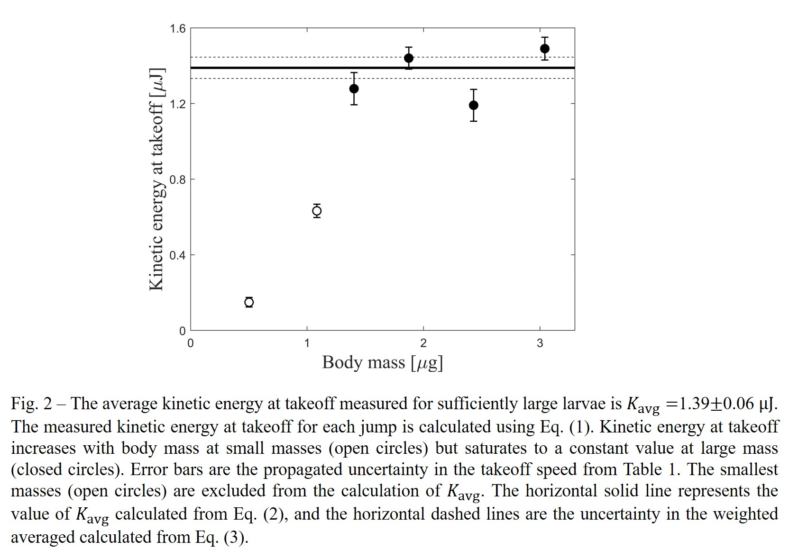
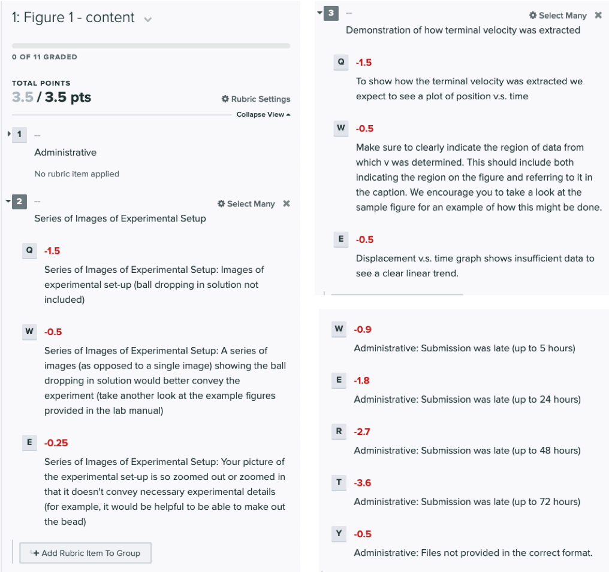
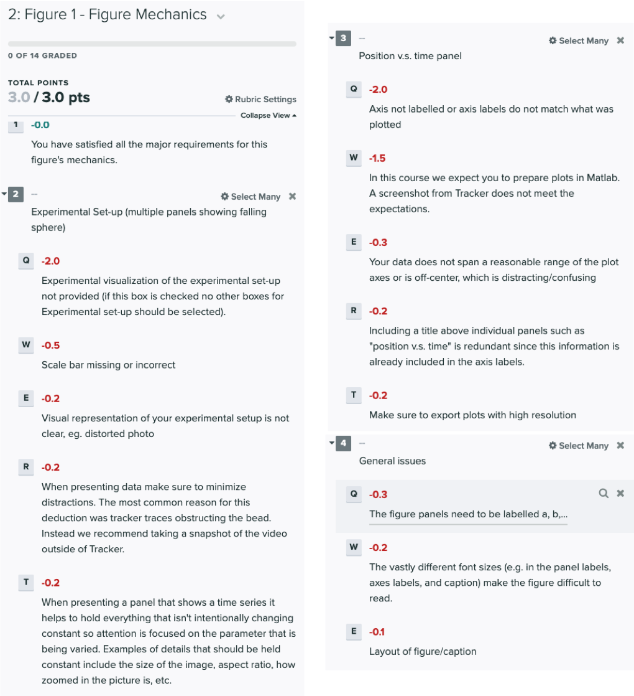
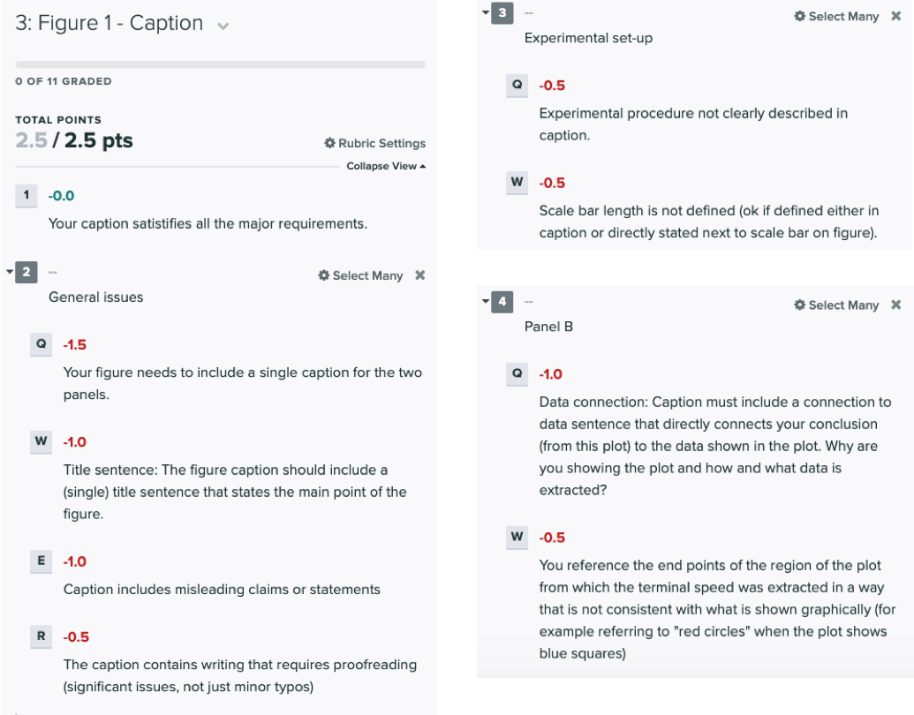
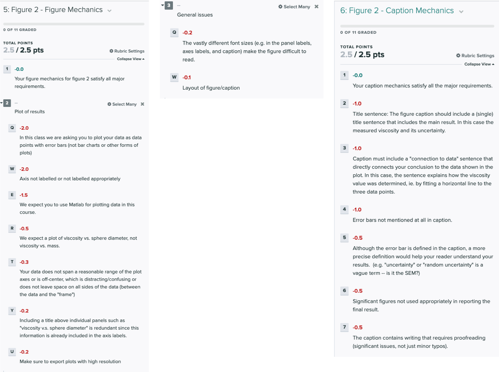

# Week 4 - A sequence of figures

In Physics 50, you will ultimately get to experience what it’s like to create a physics poster, which is like a mini version of a physics paper. In Module 1, you created a single figure with a caption. For the Module 2 deliverable, you will produce a series of figures, with captions, that summarize the method and logic you used, leading to your final result for the liquid viscosity in this module.  

First, you should remind yourself of the [guidelines for creating a single figure](https://physics-50.github.io/Module-1/week4#week-4-communicating-written-scientific-results-physics-style){:target="_blank"}, and look up any feedback you received about your Module 1 deliverable on Gradescope. We are building off of the single figure from Module 1, and the same standards apply to each of the figures you create for the Module 2 deliverable.

## How to use a sequence of figures to make a claim

As with any piece of writing, we always recommend starting from an (evidentiary) outline. The first step is often to determine: **what is my main result/claim?** 

What interesting/exciting/new idea have you discovered? What was your scientific goal of doing the experiments you just completed? Your experiment was conceived to test a specific hypothesis, and the data taking process you developed was designed to elucidate relationships between a specific set of parameters, relationships that will ultimately let you test that hypothesis. For the data you have taken, which relationships between parameters - there may be more than one - allow you to make a statement about the validity of your hypothesis?Plotting these relationships gives you the evidence that you will use to support your main result.

 The main result is important, so it should be the focus of your most prominent figure. This main figure/plot is often referred to as the "money plot." When others think about the results of your work, this compelling visual will provide them with a convenient way to remember your result. The evidence that supports your main result is what goes in the money plot. What evidence do you have to support the main claim/result? In experimental work, this evidence is almost always some "processed" data that is extracted out from the "raw" data of your experiment. 

For example, in our Module 1 experiments, the main result was presented in your plot of the coefficient of static friction versus mass. The "raw" data were the individual measurements of the angle, and from that "raw" data you extracted the "processed" data: coefficient of static friction.

After you have an idea of your main figure, you need to decide what information a reader will need to understand your main result. This required information/context will inform what other figures need to be included. You should provide a visual representation of how you obtained data, some of the intermediate data processing steps that occur, and any other relevant information a reader might need (e.g. other important quantities used to generate the information in the money plot).

The sequence of figures often builds in complexity towards the main result. Sometimes starting with an ["overview figure"](https://www.nature.com/articles/nmeth0511-365){:target="_blank"} provides a useful schematic context to understand your experimental process and what data will emerge. 

After you have the main result sequence down, you should ask yourself if there are any interesting secondary results that you have discovered. Then go through the same process you did for the main result, and try to weave the secondary results into your sequence of figures. Unless the main result relies on them, these secondary results usually appear in the sequence after the main result because we don't want to bury our main result behind a series of less-important secondary information. 

So to summarize:

+ start with an evidentiary outline (your evidence is your own data)
+ focus on your main result first, make a figure that summarizes the evidence you have to support your main result/claim
+ make a series of figures that build in complexity, which give your reader context to understand your evidence
+ add in any secondary claims and evidence to support them; add any additional context needed to understand evidence for these too
+ consider making an overview figure if your sequence of figures might be difficult to follow

 
 

## Example of a sequence of figures

To make some of these ideas more concrete, let's step through a made-up sequence of figures that is loosely based on [Farley et al. *Journal of Experimental Biology* (2019)](images/Farley et al Journal Experimental Biology 2019.pdf){:target="_blank"}. If you'd like to see an excellent **real example** of a sequence of figures, then please **go through that paper only looking at the figures and captions**. You should be able to follow the main results of that work just by reading the figures, and almost every figure is a great example of the lessons we wanted you to take from Module 1.

But if you'd prefer to see something that might more closely resemble the types of choices you will need to make for your Module 2 deliverable, let's look at the following made-up sequence of figures. Important: **this data is made up** and is meant only to illustrate what a short sequence of figures may look like for a simple example.

------------------------------------------------

### Outlining

Suppose we had taken videos of midge larvae jumping, and when we looked at the kinetic energy of the jumps we noticed that the smallest larvae's jumps had kinetic energy that depended on their size, but the kinetic energy of the largest larvae's jumps were all approximately constant.

So the main result here is that there's a maximum average value of the kinetic energy for the jumping midge larvae. (**Reminder: this is made up and not actually true in nature.**)

This is the basis of what we would want to turn into our money plot.  

But what information does a reader need to understand this money plot? They need context for the following:

+ where does the kinetic energy come from? 
    + mass and takeoff speed
+ where does mass come from?
    + measured directly
+ where does takeoff speed come from?
    + measured from position vs. time plot
+ where does the position vs. time plot come from? 
    + videos of midge jumping

We see that we have traced the evidence back to the "raw" data from the experiment. In this example, the "raw" data are the many videos of the midge larvae jumping. The "processed" data are the average kinematic quantities. 

Based on this information, and after several revisions, we might come up with the following sequence of two figures to support our claim.

---------------------------------------------

### Figure Sequence

[*Click  to enlarge in a new tab*
](images/Fig1.jpg){:target="_blank"}

-----------------------------------

[*Click  to enlarge in a new tab*
](images/Fig2.jpg){:target="_blank"}

-------------------------------------

Let's think about the underlying purpose of each of those two figures with the following miniquestions: 

#### Miniquestion 1: What was the purpose of Figure 1?
(make sure you click "View score" after completion)

*[Click here to open in a new tab](https://forms.gle/vytFUxLEgTfBQt3K7){:target="_blank"}*

<iframe src="https://docs.google.com/forms/d/e/1FAIpQLScTOJ4ciCjps3Jx-SFOx3djpzWydPSf0iT5sRAMciMb9Ev05w/viewform?embedded=true" width="640" height="300" frameborder="0" marginheight="0" marginwidth="0">Loading…
</iframe>

#### Miniquestion 2: What was the purpose of Figure 2?
(make sure you click "View score" after completion)

*[Click here to open in a new tab](https://forms.gle/k2xF6EaWcc95ymEA9){:target="_blank"}*

<iframe src="https://docs.google.com/forms/d/e/1FAIpQLSc2u3O6oH8HD-3ifyGipgOVB-6rex1uvTub_CVnyGeYpqAu8Q/viewform?embedded=true" width="640" height="300" frameborder="0" marginheight="0" marginwidth="0">Loading…
</iframe>

### Specific Expectations for Figures and MATLAB Scripts

The MATLAB commands used to generate the plots in the example figure sequence are based on our Matlab scripts to date, but with some modifications. You will want to use the sample figure 2 as a guide for your second figure. Notice that in the sample figure both the data from the range of masses for which the kinetic energy at take-off depends on mass and that for which it does not, have been included in the plot; but only the data for which the kinetic energy does not depend on mass is included in the fit. This allows both the primary and secondary results to be presented in the same figure. Notice how solid vs. hollow circles were used to distinguish the data points that were and were not included in the fit. Do you see an analogy with your results from this module? 

**We expect your second figure to include your results from all four sphere diameters, but only the spheres for which inertial drag was negligible should be included in the fit. This will mean using the results of your fit from week 3, but now superimposing them as a horizontal line on a plot of the entire data set. We also expect you to plot your uncertainty (as determined in week 3) as dashed horizontal lines as was done in Fig. 2 and to make use of solid vs. hollow circles to distinguish points that were and were not included in the fit.**

Finally, take a look at figure 1. Notice how the multipanel video sequence gives a clearer indication of the experiment than a single picture. Do you see an analogy to this experiment? Similarly take another look at the panel showing how the data was extracted. **Key features include the circling of the data points used to extract a velocity from the plot. We expect you to similarly give us a clear visual of determined the terminal velocity from one sample plot. Showing a screen shot from Tracker will not be sufficient, for the deliverable you need to plot the data in Matlab and pay attention to the aesthetics of your plot.**

To help you with this we are providing the Matlab script used for the above figures to get you started. You will have to modify the script appropriately for your own data. New features you will need that we have introduced in this script are:
+ plotting without error bars (Fig. 1b)
+ plotting with open vs closed circles (Fig. 2)
+ adding horizontal lines to the plot (Fig. 2)

Run the script ["using_the_plot_function.m"](using_the_plot_function.m) to see an example of how to perform all three of those modifications. 

All of the other annotations on the figures were added using Powerpoint.

---------------------------

## Module 2 Deliverable

What do I need to make for Module 2?

For Module 2, your deliverable is a series of two figures (each including a caption), summarizing the data and analysis you used (including the logic that drove your decisions) and leading up to your final result for the viscosity of the liquid in this module.  Keep in mind that your figures should make the overall process and results understandable to someone who has your physics background but who is not enrolled in this course and has not seen the experimental videos or read any of the instructions. The two example figures provided above were carefully chosen to be representative of what we are looking for in a two figure sequence. We encourage you to look at them carefully and come talk to us in office hours if you are unsure how to approach your two figure sequence in a similar way. Your final result for the liquid viscosity (including uncertainty!) should be given somewhere in both the last figure and its caption.

In drawing your conclusions please note that is is okay if some of your data points' error bars do not overlap with the horizontal line. This is actually a good thing - a rule of thumb is that **we should expect the data points to be about one error bar away from the line on average**. We will learn more about this in Module 3.

### Assumed Information

You can assume the following information is defined for your reader somewhere in the main text of where this sequence of figures appears:

+ any equations you used
+ information about the spheres (eg. their masses and radii)
+ the values with uncertainties of $$g$$ and $$\rho$$, and how those quantities were measured

## What do I need to submit?

+ Images of your sequence of figures: two images (.jpg or .png), one image for each of your two figures. You are expected to upload each figure 3 times. Please follow the instructions on Gradescope.
+ A link to all of your data from Module 2, with access shared with your instructors 

You will submit your Module 2 Deliverable Gradescope. Reminder, the deliverable is **due Thursday, April 1, at 1:00pm PT**.

## Your figure sequence must include

* Figure 1
    * a **sequence** of photos demonstrating how data was collected, with
        * a **scale bar** placed in a lower corner of the photo
        * minimal visual distractions (no tracker trails)
    * position vs. time plot showing how terminal speed was determined (including suggestions made under specific expectations above)

+ Figure 2
    * plot of viscosity as a function of sphere diameter, with
    * **axes**, with axis labels, units, and tick marks
    * **data points**, with consistent data point symbols
    * **error bars**, attached to the individual data points
    * **main result**, your main result should be included in this figure. In this case a graphic representation (horizontal lines) showing the determined viscosity and its uncertainty
    * **secondary result**, in this case the exploration of those spheres for which inertial drag was and was not significant
    * pay attention to suggestions made under specific expectations above
   
The figures must also include captions with the following:
1. **Both Figures:** A **title sentence** (with a verb) that briefly states what to conclude from the figure

2. **Figure 1:** 
   + a brief **explanation of the experiment**
   + a definition of the **scale bar**
   + a **connection to data** sentence that directly connects your conclusion (from this plot) to the data shown in the plot, in this case indicating how the terminal speed was determined.

3. **Figure 2:**
   + a definition of the **error bars**
   + a **connection to data** sentence that directly connects your conclusion to the data shown in the plot
   + a clear connection to the secondary result
   + a clear indication as to what the horizontal lines represent
   + appropriate use of significant figures in reporting the final result

   ## Grading rubric

The tentative rubric that will be used to evaluate this checkpoint is provided below. Please keep in mind that these rubric items are subject to change as we can never foresee all the issues that may arise. This is meant to give you a sense of how it will be graded.

Your deliverable will be graded out of 18 points. 

**Click on the below images to enlarge in a new tab:**

{:target="_blank"}

{:target="_blank"}

{:target="_blank"}

{:target="_blank"}

Your deliverable will also be graded for the quality of your data and the conclusions you drew. This will appear in Gradescope as: 
"Question 4: Figure 2 - Content". [4 points]
 
